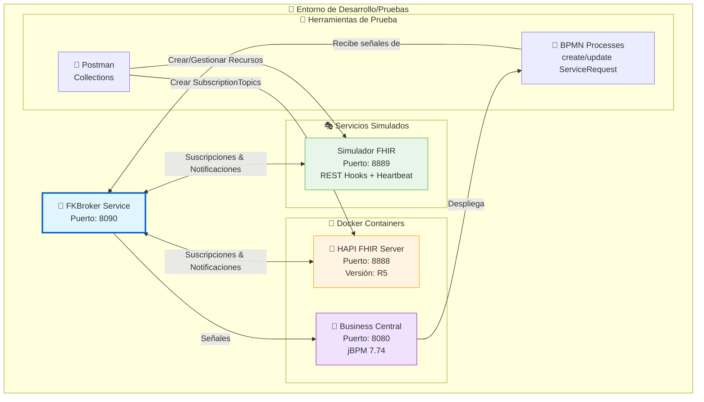
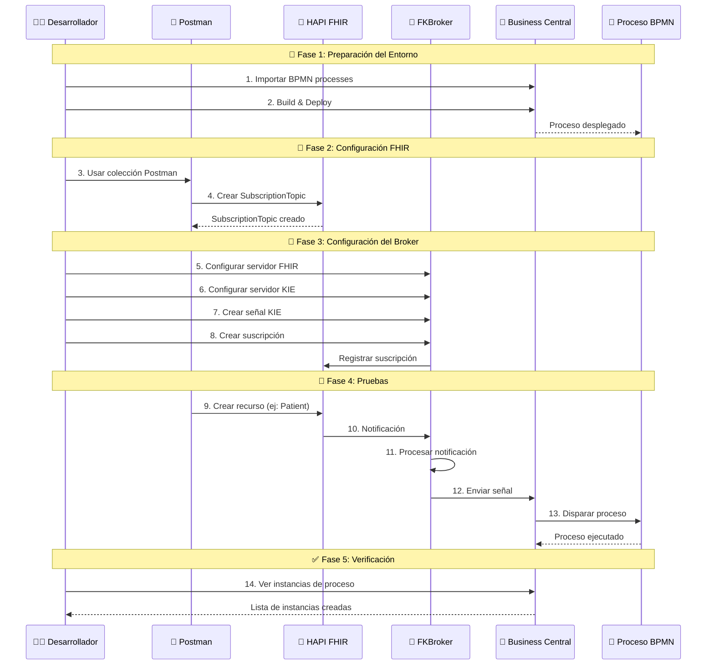

# 📦 Recursos para Verificar el Bróker

En esta carpeta, encontrarás una colección de recursos que facilitan la verificación y desarrollo del servicio FKBroker.

El bróker interactúa con servidores FHIR y servidores KIE. Se proporciona un fichero docker compose que permite la ejecución de un servidor HAPI FHIR y de Business Central en docker.

Además se proporcionan ficheros para facilitar la creación de recursos FHIR desde Postman y los BPMN de dos procesos configurados para recibir señales.

También se proporciona un **🎭 Simulador de Servidor FHIR** que implementa toda la lógica de suscripciones, incluyendo mensajes de handshake y heartbeat y las operaciones especiales `$status` y `$events`.

## 📑 Índice
- [📁 Estructura de Archivos](#-estructura-de-archivos)
- [🏗️ Arquitectura de Verificación](#️-arquitectura-de-verificación)
- [📋 Contenidos Detallados](#-contenidos-detallados)
- [⚙️ Requisitos](#️-requisitos)
- [🚀 Instrucciones de Uso](#-instrucciones-de-uso)

## 📁 Estructura de Archivos

```
Resources/
│
├── 📄 leeme.md                                          # Este archivo
├── 📄 readme.md                                         # Versión en inglés
│
├── 🐳 Docker & Configuración
│   ├── docker-compose.yaml                             # Orquestación de contenedores
│   └── application.yaml                                # Configuración HAPI FHIR Server
│
├── 🔄 Procesos de Negocio (BPMN)
│   ├── create-ServiceRequest.bpmn                      # Proceso para creación
│   └── update-ServiceRequest.bpmn                      # Proceso para actualización
│
├── 📮 Colecciones Postman
│   ├── Solicitudes servidor FHIR.postman_collection.json
│   └── Solicitudes Simulador Servidor FHIR.postman_collection.json
│
├── 🎭 Servicios de Prueba
│   ├── fhirserver-service/                             # Simulador de Servidor FHIR
│   │   ├── src/
│   │   ├── pom.xml
│   │   └── readme.md
│   │
│   └── fkbroker-kjar/                                  # Proyecto KIE preconfigurado
│       ├── src/
│       ├── pom.xml
│       └── readme.md
│
└── 🖼️ img/                                              # Capturas de pantalla
    ├── proyectoEnBC.jpg
    └── servidorKIEEnEjecucion.jpg
```

## 🏗️ Arquitectura de Verificación



## 🔀 Flujo de Trabajo de Pruebas



## 📋 Contenidos Detallados

### 🐳 Docker Compose
**Archivo:** `docker-compose.yaml`

Despliega automáticamente:
- **🏥 HAPI FHIR Server (R5)**: Puerto 8888
  - Base de datos H2 integrada
  - Soporte completo para suscripciones REST Hook
  - Interfaz web en `/`
  
- **🧠 Business Central**: Puerto 8080
  - Usuario: `admin` / Contraseña: `admin`
  - KIE Server integrado
  - Interfaz de diseño de procesos

### ⚙️ Configuración FHIR
**Archivo:** `application.yaml`

Configuración del servidor HAPI FHIR:
- ✅ Versión FHIR R5
- ✅ Suscripciones REST Hook habilitadas
- ✅ Puerto personalizable
- ✅ Persistencia en H2

### 🔄 Procesos de Negocio BPMN

#### 📝 create-ServiceRequest.bpmn
- **Señal:** `create-ServiceRequest`
- **Propósito:** Procesa la creación de nuevas solicitudes de servicio
- **Trigger:** Notificación de creación de recurso FHIR ServiceRequest

#### 🔄 update-ServiceRequest.bpmn
- **Señal:** `update-ServiceRequest`
- **Propósito:** Procesa actualizaciones de solicitudes de servicio
- **Trigger:** Notificación de actualización de recurso FHIR ServiceRequest

### 📮 Colecciones Postman

#### 🏥 Solicitudes servidor FHIR.postman_collection.json
**Operaciones incluidas:**
- ✅ Crear SubscriptionTopic
- ✅ Listar SubscriptionTopics
- ✅ Obtener detalles de SubscriptionTopic
- ✅ Crear recursos FHIR (Patient, ServiceRequest, etc.)
- ✅ Buscar recursos

**Casos de uso:**
- Preparar servidor FHIR para pruebas
- Crear topics personalizados
- Generar eventos para probar notificaciones

#### 🎭 Solicitudes Simulador Servidor FHIR.postman_collection.json
**Operaciones incluidas:**
- ✅ CRUD completo de SubscriptionTopic
- ✅ CRUD completo de Subscription
- ✅ Operación especial `$status`
- ✅ Operación especial `$events`
- ✅ Gestión de heartbeat
- ✅ Handshake de suscripciones

**Casos de uso:**
- Probar funcionalidades sin servidor FHIR real
- Validar lógica de suscripciones
- Simular escenarios de error

### 🎭 Simulador de Servidor FHIR
**Directorio:** `fhirserver-service/`

Implementación completa de:
- 🏥 API REST FHIR R5 (subconjunto)
- 📝 Framework de suscripciones
- 💓 Heartbeat checks
- 🤝 Handshake protocol
- 📊 Operaciones `$status` y `$events`

Ver `fhirserver-service/readme.md` para más detalles.

### 📦 KJAR Preconfigurado
**Directorio:** `fkbroker-kjar/`

Proyecto KIE listo para usar:
- ✅ Procesos BPMN incluidos
- ✅ Configuración de señales
- ✅ Dependencias configuradas
- ✅ Listo para Build & Deploy

## ⚙️ Requisitos

### 💻 Software Necesario
- **🐳 Docker Desktop**: Para ejecutar contenedores
  - [Descargar Docker](https://www.docker.com/products/docker-desktop)
- **📮 Postman**: Para ejecutar las colecciones de prueba
  - [Descargar Postman](https://www.postman.com/downloads/)
- **☕ Java 8+**: Si se quiere ejecutar servicios sin Docker
- **📦 Maven 3.6.3+**: Para compilar proyectos localmente

### 🔌 Puertos Requeridos
- **8080**: Business Central
- **8888**: HAPI FHIR Server
- **8889**: Simulador FHIR (opcional)
- **8090**: FKBroker Service

## 🚀 Instrucciones de Uso

### 1️⃣ Arrancar los Servidores FHIR y Business Central

#### 🐳 Usando Docker Compose (Recomendado)

```bash
# Desde la carpeta Resources/
docker compose up -d
```

**✅ Verificar que los contenedores están corriendo:**

```bash
docker ps
```

**🌐 Acceso a los servicios:**
- 🧠 **Business Central**: http://localhost:8080
  - Usuario: `admin`
  - Contraseña: `admin`
- 🏥 **HAPI FHIR Server**: http://localhost:8888

**🛑 Para detener los servicios:**

```bash
docker compose down
```

### 2️⃣ Configurar Business Central y Desplegar Procesos

#### 📦 Opción A: Importar BPMN Individuales

1. **🔑 Acceder a Business Central**:
   - Abrir navegador en `http://localhost:8080`
   - Login: `admin` / `admin`

2. **📁 Crear Proyecto**:
   - Menú: "Design" → "Projects"
   - Click en "Add Project"
   - Nombre: `fkbroker-processes` (o el que prefieras)
   - Click "Add"

3. **📥 Importar Activos BPMN**:
   - Dentro del proyecto, click en "Import Asset"
   - Seleccionar `create-ServiceRequest.bpmn`
   - Repetir para `update-ServiceRequest.bpmn`

   

4. **🚀 Build & Deploy**:
   - Click en "Build" → "Deploy"
   - Esperar confirmación de despliegue exitoso

   

#### 📦 Opción B: Usar KJAR Preconfigurado

1. **📂 Importar proyecto completo**:
   - En Business Central: "Design" → "Projects"
   - "Import Project"
   - Seleccionar carpeta `fkbroker-kjar/`

2. **🚀 Build & Deploy**:
   - Click en "Build" → "Deploy"

### 3️⃣ Verificar Servidor KIE

**🔍 Comprobar que el servidor KIE está activo:**

1. Menú: "Deploy" → "Execution Servers"
2. Debe aparecer un servidor con estado "Running"
3. El contenedor desplegado debe estar listado

### 4️⃣ Configurar Servidor FHIR con Postman

1. **📮 Abrir Postman**

2. **📥 Importar Colección**:
   - Click en "Import"
   - Seleccionar `Solicitudes servidor FHIR.postman_collection.json`

3. **📝 Crear SubscriptionTopic**:
   - Navegar a la carpeta correspondiente
   - Ejecutar request de creación de SubscriptionTopic
   - Ejemplo: Topic para ServiceRequest

4. **✅ Verificar creación**:
   - Ejecutar request de listado de topics
   - Confirmar que el topic fue creado

### 5️⃣ Configurar FKBroker

1. **🏥 Registrar Servidor FHIR**:
   - Acceder a FKBroker: `http://localhost:8090`
   - FHIR Servers → Add Server
   - URL: `http://localhost:8888/fhir`

2. **🧠 Registrar Servidor KIE**:
   - KIE Servers → Add Server
   - URL: `http://localhost:8080/kie-server/services/rest/server`
   - Usuario: `admin`
   - Contraseña: `admin`
   - Contenedor: (nombre del contenedor desplegado)

3. **⚡ Crear Señal**:
   - Signals → Add Signal
   - Nombre: `create-ServiceRequest`
   - Servidor KIE: (seleccionar el registrado)

4. **📝 Crear Suscripción**:
   - Subscriptions → Create Subscription
   - Servidor FHIR: (seleccionar)
   - Topic: (seleccionar topic creado)
   - Señal KIE: `create-ServiceRequest`

### 6️⃣ Probar el Flujo Completo

#### 🧪 Generar Evento FHIR

**Usando Postman:**
```bash
POST http://localhost:8888/fhir/ServiceRequest
Content-Type: application/fhir+json

{
  "resourceType": "ServiceRequest",
  "status": "active",
  "intent": "order",
  "subject": {
    "reference": "Patient/123"
  }
}
```

#### ✅ Verificar Resultados

1. **📊 En FKBroker**:
   - Ver logs de notificaciones recibidas
   - Verificar que la señal fue enviada

2. **🧠 En Business Central**:
   - Menú: "Manage" → "Process Instances"
   - Debe aparecer una nueva instancia del proceso
   - Estado: "Active" o "Completed"

### 7️⃣ Usar Simulador de Servidor FHIR (Opcional)

Si prefieres usar el simulador en lugar del servidor HAPI FHIR:

```bash
cd fhirserver-service
mvn spring-boot:run
```

El simulador estará disponible en `http://localhost:8889`

**📮 Usar colección de Postman específica:**
- Importar `Solicitudes Simulador Servidor FHIR.postman_collection.json`
- Cambiar URL base a `http://localhost:8889`

### 8️⃣ Alternativa: Servidor FHIR Local sin Docker

Si prefieres ejecutar HAPI FHIR sin Docker:

```bash
# 1. Clonar repositorio
git clone https://github.com/hapifhir/hapi-fhir-jpaserver-starter
cd hapi-fhir-jpaserver-starter

# 2. Copiar configuración
cp /path/to/FKBroker/Resources/application.yaml src/main/resources/

# 3. Editar application.yaml si es necesario
# - Cambiar puerto: server.port=8888
# - Versión FHIR: hapi.fhir.fhir_version=R5
# - Habilitar subscriptions: hapi.fhir.subscription.resthook_enabled=true

# 4. Ejecutar
mvn spring-boot:run
```

## 🐛 Solución de Problemas

### ❌ Los contenedores Docker no arrancan

**Problema:** Puertos ya en uso

**Solución:**
```bash
# Verificar qué está usando los puertos
netstat -ano | findstr :8080
netstat -ano | findstr :8888

# Detener proceso o cambiar puerto en docker-compose.yaml
```

### ❌ No se pueden importar los BPMN en Business Central

**Problema:** Formato incompatible

**Solución:**
- Verificar que los archivos .bpmn no estén corruptos
- Usar la opción "Import Asset" en lugar de copiar/pegar
- Como alternativa, usar el KJAR preconfigurado

### ❌ Las notificaciones no llegan al broker

**Problema:** URL de callback incorrecta

**Solución:**
```properties
# En application.properties del broker
application.address=http://host.docker.internal:8090/

# Si FHIR está en Docker, usar host.docker.internal en lugar de localhost
```

### ❌ Business Central no muestra el servidor KIE

**Problema:** Despliegue incorrecto

**Solución:**
1. Verificar logs de Business Central
2. Hacer "Clean and Install" antes de "Deploy"
3. Reiniciar contenedor si es necesario

## 📚 Recursos Adicionales

- 📖 **Documentación HAPI FHIR**: https://hapifhir.io/
- 📖 **Documentación jBPM**: https://www.jbpm.org/
- 📖 **Especificación FHIR R5**: http://hl7.org/fhir/R5/
- 📖 **FHIR Subscriptions**: http://hl7.org/fhir/R5/subscriptions.html

## 🤝 Contribuir

Si encuentras errores o tienes sugerencias para mejorar estos recursos de prueba, por favor abre un issue en el [repositorio principal](https://github.com/tfg-projects-dit-us/FKBroker).

---

💡 **Tip**: Para un flujo de trabajo más eficiente, mantén todos los servicios corriendo simultáneamente y usa Postman para automatizar pruebas repetitivas.

