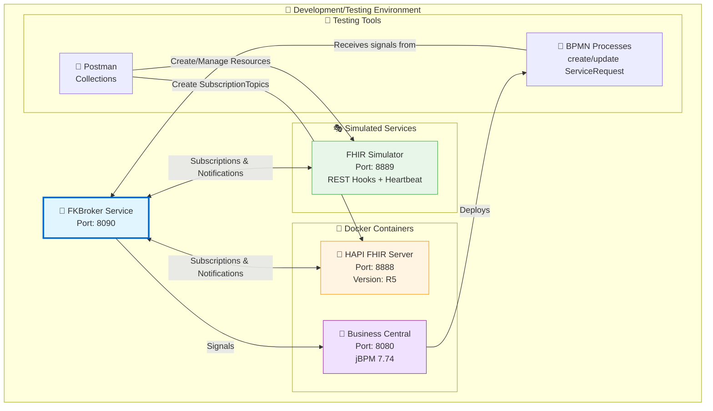
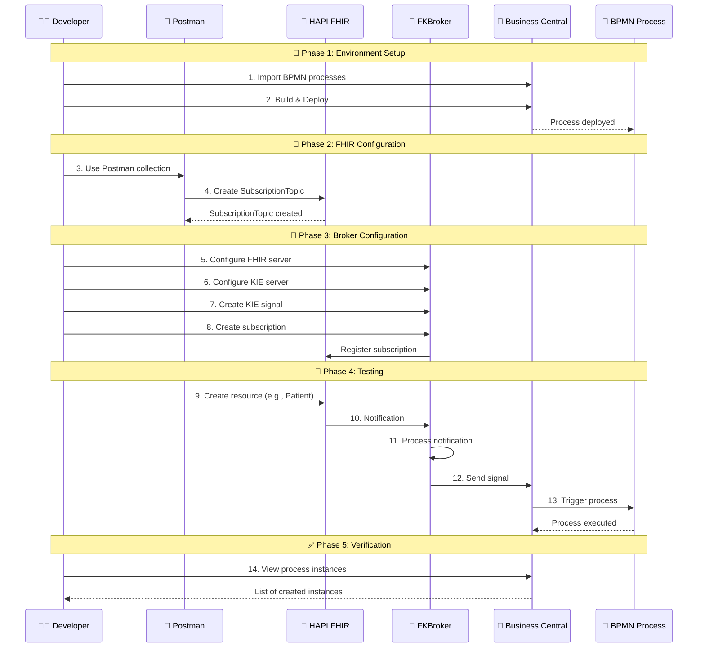

# 📦 Resources for Broker Verification

In this folder, you'll find a collection of resources that facilitate the verification and development of the FKBroker service.

The broker interacts with FHIR servers and KIE servers. A docker compose file is provided that allows the execution of a HAPI FHIR server and Business Central in Docker.

Additionally, files are provided to facilitate the creation of FHIR resources from Postman and the BPMN of two processes configured to receive signals.

Also provided is a **🎭 FHIR Server Simulator** that implements all subscription logic, including handshake and heartbeat messages and the special `$status` and `$events` operations.

## 📑 Table of Contents
- [📁 File Structure](#-file-structure)
- [🏗️ Verification Architecture](#️-verification-architecture)
- [📋 Detailed Contents](#-detailed-contents)
- [⚙️ Requirements](#️-requirements)
- [🚀 Usage Instructions](#-usage-instructions)

## 📁 File Structure

```
Resources/
│
├── 📄 leeme.md                                          # Spanish version
├── 📄 readme.md                                         # This file
│
├── 🐳 Docker & Configuration
│   ├── docker-compose.yaml                             # Container orchestration
│   └── application.yaml                                # HAPI FHIR Server configuration
│
├── 🔄 Business Processes (BPMN)
│   ├── create-ServiceRequest.bpmn                      # Creation process
│   └── update-ServiceRequest.bpmn                      # Update process
│
├── 📮 Postman Collections
│   ├── Solicitudes servidor FHIR.postman_collection.json
│   └── Solicitudes Simulador Servidor FHIR.postman_collection.json
│
├── 🎭 Test Services
│   ├── fhirserver-service/                             # FHIR Server Simulator
│   │   ├── src/
│   │   ├── pom.xml
│   │   └── readme.md
│   │
│   └── fkbroker-kjar/                                  # Pre-configured KIE project
│       ├── src/
│       ├── pom.xml
│       └── readme.md
│
└── 🖼️ img/                                              # Screenshots
    ├── proyectoEnBC.jpg
    └── servidorKIEEnEjecucion.jpg
```

## 🏗️ Verification Architecture



## 🔀 Test Workflow



## 📋 Detailed Contents

### 🐳 Docker Compose
**File:** `docker-compose.yaml`

Automatically deploys:
- **🏥 HAPI FHIR Server (R5)**: Port 8888
  - Integrated H2 database
  - Full support for REST Hook subscriptions
  - Web interface at `/`
  
- **🧠 Business Central**: Port 8080
  - User: `admin` / Password: `admin`
  - Integrated KIE Server
  - Process design interface

### ⚙️ FHIR Configuration
**File:** `application.yaml`

HAPI FHIR server configuration:
- ✅ FHIR R5 version
- ✅ REST Hook subscriptions enabled
- ✅ Customizable port
- ✅ H2 persistence

### 🔄 BPMN Business Processes

#### 📝 create-ServiceRequest.bpmn
- **Signal:** `create-ServiceRequest`
- **Purpose:** Processes the creation of new service requests
- **Trigger:** FHIR ServiceRequest resource creation notification

#### 🔄 update-ServiceRequest.bpmn
- **Signal:** `update-ServiceRequest`
- **Purpose:** Processes service request updates
- **Trigger:** FHIR ServiceRequest resource update notification

### 📮 Postman Collections

#### 🏥 Solicitudes servidor FHIR.postman_collection.json
**Included operations:**
- ✅ Create SubscriptionTopic
- ✅ List SubscriptionTopics
- ✅ Get SubscriptionTopic details
- ✅ Create FHIR resources (Patient, ServiceRequest, etc.)
- ✅ Search resources

**Use cases:**
- Prepare FHIR server for testing
- Create custom topics
- Generate events to test notifications

#### 🎭 Solicitudes Simulador Servidor FHIR.postman_collection.json
**Included operations:**
- ✅ Full CRUD for SubscriptionTopic
- ✅ Full CRUD for Subscription
- ✅ Special operation `$status`
- ✅ Special operation `$events`
- ✅ Heartbeat management
- ✅ Subscription handshake

**Use cases:**
- Test functionalities without real FHIR server
- Validate subscription logic
- Simulate error scenarios

### 🎭 FHIR Server Simulator
**Directory:** `fhirserver-service/`

Complete implementation of:
- 🏥 FHIR R5 REST API (subset)
- 📝 Subscription framework
- 💓 Heartbeat checks
- 🤝 Handshake protocol
- 📊 `$status` and `$events` operations

See `fhirserver-service/readme.md` for more details.

### 📦 Pre-configured KJAR
**Directory:** `fkbroker-kjar/`

Ready-to-use KIE project:
- ✅ BPMN processes included
- ✅ Signal configuration
- ✅ Dependencies configured
- ✅ Ready for Build & Deploy

## ⚙️ Requirements

### 💻 Required Software
- **🐳 Docker Desktop**: To run containers
  - [Download Docker](https://www.docker.com/products/docker-desktop)
- **📮 Postman**: To execute test collections
  - [Download Postman](https://www.postman.com/downloads/)
- **☕ Java 8+**: If you want to run services without Docker
- **📦 Maven 3.6.3+**: To compile projects locally

### 🔌 Required Ports
- **8080**: Business Central
- **8888**: HAPI FHIR Server
- **8889**: FHIR Simulator (optional)
- **8090**: FKBroker Service

## 🚀 Usage Instructions

### 1️⃣ Start FHIR and Business Central Servers

#### 🐳 Using Docker Compose (Recommended)

```bash
# From the Resources/ folder
docker compose up -d
```

**✅ Verify containers are running:**

```bash
docker ps
```

**🌐 Service access:**
- 🧠 **Business Central**: http://localhost:8080
  - User: `admin`
  - Password: `admin`
- 🏥 **HAPI FHIR Server**: http://localhost:8888

**🛑 To stop services:**

```bash
docker compose down
```

### 2️⃣ Configure Business Central and Deploy Processes

#### 📦 Option A: Import Individual BPMNs

1. **🔑 Access Business Central**:
   - Open browser at `http://localhost:8080`
   - Login: `admin` / `admin`

2. **📁 Create Project**:
   - Menu: "Design" → "Projects"
   - Click "Add Project"
   - Name: `fkbroker-processes` (or your preference)
   - Click "Add"

3. **📥 Import BPMN Assets**:
   - Inside the project, click "Import Asset"
   - Select `create-ServiceRequest.bpmn`
   - Repeat for `update-ServiceRequest.bpmn`

   

4. **🚀 Build & Deploy**:
   - Click "Build" → "Deploy"
   - Wait for successful deployment confirmation

   

#### 📦 Option B: Use Pre-configured KJAR

1. **📂 Import complete project**:
   - In Business Central: "Design" → "Projects"
   - "Import Project"
   - Select `fkbroker-kjar/` folder

2. **🚀 Build & Deploy**:
   - Click "Build" → "Deploy"

### 3️⃣ Verify KIE Server

**🔍 Check that KIE server is active:**

1. Menu: "Deploy" → "Execution Servers"
2. A server with "Running" status should appear
3. The deployed container should be listed

### 4️⃣ Configure FHIR Server with Postman

1. **📮 Open Postman**

2. **📥 Import Collection**:
   - Click "Import"
   - Select `Solicitudes servidor FHIR.postman_collection.json`

3. **📝 Create SubscriptionTopic**:
   - Navigate to the corresponding folder
   - Execute SubscriptionTopic creation request
   - Example: Topic for ServiceRequest

4. **✅ Verify creation**:
   - Execute topics listing request
   - Confirm the topic was created

### 5️⃣ Configure FKBroker

1. **🏥 Register FHIR Server**:
   - Access FKBroker: `http://localhost:8090`
   - FHIR Servers → Add Server
   - URL: `http://localhost:8888/fhir`

2. **🧠 Register KIE Server**:
   - KIE Servers → Add Server
   - URL: `http://localhost:8080/kie-server/services/rest/server`
   - User: `admin`
   - Password: `admin`
   - Container: (deployed container name)

3. **⚡ Create Signal**:
   - Signals → Add Signal
   - Name: `create-ServiceRequest`
   - KIE Server: (select registered one)

4. **📝 Create Subscription**:
   - Subscriptions → Create Subscription
   - FHIR Server: (select)
   - Topic: (select created topic)
   - KIE Signal: `create-ServiceRequest`

### 6️⃣ Test Complete Flow

#### 🧪 Generate FHIR Event

**Using Postman:**
```bash
POST http://localhost:8888/fhir/ServiceRequest
Content-Type: application/fhir+json

{
  "resourceType": "ServiceRequest",
  "status": "active",
  "intent": "order",
  "subject": {
    "reference": "Patient/123"
  }
}
```

#### ✅ Verify Results

1. **📊 In FKBroker**:
   - View received notification logs
   - Verify signal was sent

2. **🧠 In Business Central**:
   - Menu: "Manage" → "Process Instances"
   - A new process instance should appear
   - Status: "Active" or "Completed"

### 7️⃣ Use FHIR Server Simulator (Optional)

If you prefer to use the simulator instead of the HAPI FHIR server:

```bash
cd fhirserver-service
mvn spring-boot:run
```

The simulator will be available at `http://localhost:8889`

**📮 Use specific Postman collection:**
- Import `Solicitudes Simulador Servidor FHIR.postman_collection.json`
- Change base URL to `http://localhost:8889`

### 8️⃣ Alternative: Local FHIR Server without Docker

If you prefer to run HAPI FHIR without Docker:

```bash
# 1. Clone repository
git clone https://github.com/hapifhir/hapi-fhir-jpaserver-starter
cd hapi-fhir-jpaserver-starter

# 2. Copy configuration
cp /path/to/FKBroker/Resources/application.yaml src/main/resources/

# 3. Edit application.yaml if necessary
# - Change port: server.port=8888
# - FHIR version: hapi.fhir.fhir_version=R5
# - Enable subscriptions: hapi.fhir.subscription.resthook_enabled=true

# 4. Run
mvn spring-boot:run
```

## 🐛 Troubleshooting

### ❌ Docker containers won't start

**Problem:** Ports already in use

**Solution:**
```bash
# Check what's using the ports
netstat -ano | findstr :8080
netstat -ano | findstr :8888

# Stop process or change port in docker-compose.yaml
```

### ❌ Cannot import BPMNs in Business Central

**Problem:** Incompatible format

**Solution:**
- Verify that .bpmn files are not corrupted
- Use "Import Asset" option instead of copy/paste
- Alternatively, use the pre-configured KJAR

### ❌ Notifications don't reach the broker

**Problem:** Incorrect callback URL

**Solution:**
```properties
# In broker's application.properties
application.address=http://host.docker.internal:8090/

# If FHIR is in Docker, use host.docker.internal instead of localhost
```

### ❌ Business Central doesn't show KIE server

**Problem:** Incorrect deployment

**Solution:**
1. Check Business Central logs
2. Do "Clean and Install" before "Deploy"
3. Restart container if necessary

## 📚 Additional Resources

- 📖 **HAPI FHIR Documentation**: https://hapifhir.io/
- 📖 **jBPM Documentation**: https://www.jbpm.org/
- 📖 **FHIR R5 Specification**: http://hl7.org/fhir/R5/
- 📖 **FHIR Subscriptions**: http://hl7.org/fhir/R5/subscriptions.html

## 🤝 Contributing

If you find errors or have suggestions to improve these testing resources, please open an issue in the [main repository](https://github.com/tfg-projects-dit-us/FKBroker).

---

💡 **Tip**: For a more efficient workflow, keep all services running simultaneously and use Postman to automate repetitive tests.
