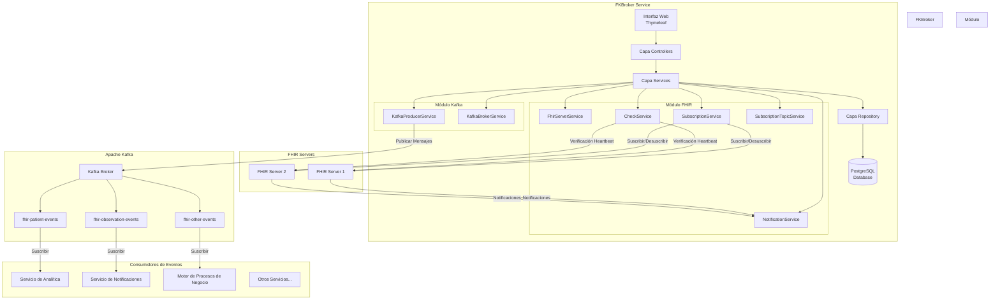
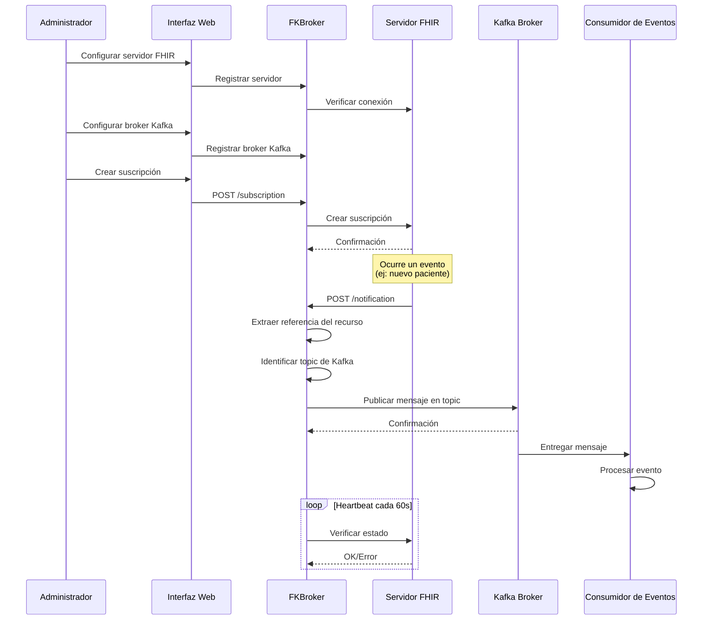

# 🔄 FKBroker Service - Bróker FHIR-Kafka

## 📑 Índice
- [📖 Descripción General](#-descripción-general)
- [🏗️ Arquitectura](#️-arquitectura)
- [⚙️ Tecnologías Base](#️-tecnologías-base)
- [📁 Estructura del Proyecto](#-estructura-del-proyecto)
- [✨ Características](#-características)
- [📋 Requisitos](#-requisitos)
- [🚀 Instalación y Configuración](#-instalación-y-configuración)
- [💡 Uso](#-uso)
- [🌐 Endpoints](#-endpoints)
- [🔧 Configuración Avanzada](#-configuración-avanzada)

## 📖 Descripción General

FKBroker Service es un servicio intermediario (broker) que facilita la comunicación entre servidores FHIR (Fast Healthcare Interoperability Resources) que implementan el marco de suscripción R5 y Apache Kafka para arquitecturas orientadas a eventos y streaming de datos en tiempo real.

Este servicio actúa como puente entre el paradigma de eventos de FHIR y el sistema de mensajería publicación-suscripción de Kafka, permitiendo que los cambios en recursos sanitarios sean automáticamente publicados a topics de Kafka para su consumo por múltiples aplicaciones y servicios downstream.

### 🎯 ¿Qué hace FKBroker?

1. **📝 Gestiona suscripciones FHIR**: Crea y mantiene suscripciones a eventos en servidores FHIR
2. **📬 Recibe notificaciones**: Escucha las notificaciones de cambios en recursos FHIR
3. **🔄 Publica en Kafka**: Convierte notificaciones FHIR en mensajes publicados a topics de Kafka
4. **⚡ Distribución de eventos**: Permite que múltiples consumidores procesen eventos sanitarios en tiempo real
5. **💓 Monitoriza**: Verifica el estado de las suscripciones mediante heartbeat

## 🏗️ Arquitectura



### 🔀 Flujo de Datos



## ⚙️ Tecnologías Base

### 🌱 Framework Principal
- **Spring Boot 2.6.15**: Framework base para la aplicación
  - Spring Web: Para endpoints REST y MVC
  - Spring Data JPA: Para persistencia de datos
  - Spring Security: Para autenticación y autorización
  - Spring Kafka: Para integración con Kafka
  - Thymeleaf: Motor de plantillas para la interfaz web

### 🏥 Integración FHIR
- **HAPI FHIR 7.2.0**: Biblioteca para trabajar con FHIR R5
  - `hapi-fhir-structures-r5`: Estructuras de datos FHIR R5
  - `hapi-fhir-client`: Cliente para comunicación con servidores FHIR
  - `hapi-fhir-base`: Funcionalidades base de HAPI FHIR

### 📨 Integración Kafka
- **Spring Kafka**: Integración de Spring para Apache Kafka
  - Permite publicar mensajes a topics de Kafka
  - Configuración y gestión de productores
  - Envío de mensajes basado en plantillas

### 💾 Persistencia
- **PostgreSQL**: Base de datos principal (recomendada para producción)
- **H2**: Base de datos en memoria (para desarrollo y pruebas)
- **MySQL**: Soportada como alternativa
- **Hibernate/JPA**: ORM para mapeo objeto-relacional

### 🛠️ Otras Tecnologías
- **Jackson 2.17.0**: Serialización/deserialización JSON
- **Apache CXF 3.4.10**: Framework de servicios web
- **Swagger/OpenAPI**: Documentación de API REST
- **SLF4J**: Logging
- **Maven**: Gestión de dependencias y construcción

## 📁 Estructura del Proyecto

```
fkbroker-service/
│
├── src/main/
│   ├── java/us/dit/fkbroker/service/
│   │   ├── Application.java                    # Clase principal Spring Boot
│   │   │
│   │   ├── conf/                               # Configuración
│   │   │   ├── BrokerRunner.java              # Inicialización del broker
│   │   │   ├── DefaultWebSecurityConfig.java   # Configuración de seguridad
│   │   │   ├── KafkaConfig.java                # Configuración de Kafka
│   │   │   ├── SystemPropertiesInjector.java   # Inyección de propiedades
│   │   │   └── WebConfiguration.java           # Configuración web
│   │   │
│   │   ├── controllers/                        # Capa de Controladores
│   │   │   ├── HomeController.java            # Página principal
│   │   │   ├── FhirServerController.java      # Gestión de servidores FHIR
│   │   │   ├── SubscriptionController.java    # Gestión de suscripciones
│   │   │   ├── SubscriptionTopicController.java # Gestión de topics
│   │   │   ├── NotificationController.java    # Recepción de notificaciones
│   │   │   └── MyErrorController.java         # Manejo de errores
│   │   │
│   │   ├── services/                          # Capa de Servicios
│   │   │   ├── FhirService.java              # Servicio principal FHIR
│   │   │   ├── FhirServerService.java        # Gestión de servidores
│   │   │   ├── SubscriptionService.java      # Gestión de suscripciones
│   │   │   ├── SubscriptionTopicService.java # Gestión de topics
│   │   │   ├── NotificationService.java      # Procesamiento de notificaciones
│   │   │   ├── CheckService.java             # Verificación de heartbeat
│   │   │   ├── KafkaProducerService.java     # Publicación mensajes Kafka
│   │   │   ├── KafkaBrokerService.java       # Gestión de brokers Kafka
│   │   │   │
│   │   │   └── mapper/                        # Mappers DTO-Entity
│   │   │       ├── SubscriptionMapper.java
│   │   │       ├── SubscriptionTopicMapper.java
│   │   │       └── FhirServerMapper.java
│   │   │
│   │   ├── entities/                          # Capa de Entidades
│   │   │   ├── db/                            # Entidades de BD
│   │   │   │   ├── FhirServer.java           # Servidor FHIR
│   │   │   │   ├── KafkaBroker.java          # Broker Kafka
│   │   │   │   ├── SubscriptionData.java     # Datos de suscripción
│   │   │   │   ├── Topic.java                # Topic FHIR → Topic Kafka
│   │   │   │   └── NotificationBundleData.java # Historial notificaciones
│   │   │   │
│   │   │   └── domain/                        # DTOs y objetos de dominio
│   │   │       ├── SubscriptionEntry.java
│   │   │       ├── SubscriptionForm.java
│   │   │       ├── SubscriptionTopicEntry.java
│   │   │       └── SubscriptionTopicDetails.java
│   │   │
│   │   └── repositories/                      # Capa de Repositorios
│   │       ├── FhirServerRepository.java
│   │       ├── KafkaBrokerRepository.java
│   │       ├── SubscriptionDataRepository.java
│   │       ├── TopicRepository.java
│   │       └── NotificationBundleRepository.java
│   │
│   └── resources/
│       ├── application.properties              # Configuración principal
│       ├── application-dev.properties          # Perfil desarrollo
│       ├── application-postgres.properties     # Perfil PostgreSQL
│       ├── banner.txt                          # Banner de inicio
│       │
│       ├── lang/                               # Internacionalización
│       │   ├── messages.properties
│       │   ├── messages_es.properties
│       │   └── messages_us.properties
│       │
│       ├── static/                             # Recursos estáticos
│       │   ├── access-denied.html
│       │   ├── form-styles.css
│       │   └── img/
│       │
│       └── templates/                          # Plantillas Thymeleaf
│           ├── index.html                      # Página principal
│           ├── error.html                      # Página de error
│           ├── fhir/                           # Vistas FHIR
│           │   ├── servers.html
│           │   ├── subscriptions-manager.html
│           │   ├── subscription-form.html
│           │   ├── subscription-detail.html
│           │   ├── subscriptiontopic-detail.html
│           │   └── fragments/
│           └── layout/                         # Fragmentos comunes
│               ├── header.html
│               └── topnav.html
│
├── pom.xml                                     # Configuración Maven
├── LICENSE.txt
└── readme.md
```

## ✨ Características

### 🏥 Gestión de Servidores FHIR
- ✅ Registro y configuración de múltiples servidores FHIR
- ✅ Verificación de conectividad con servidores FHIR
- ✅ Soporte para FHIR R5 (SubscriptionTopic framework)
- ✅ Exploración de SubscriptionTopics disponibles

### 📝 Gestión de Suscripciones
- ✅ Creación de suscripciones a eventos FHIR
- ✅ Visualización de suscripciones activas
- ✅ Filtrado y búsqueda de suscripciones
- ✅ Modificación de parámetros de suscripción
- ✅ Eliminación de suscripciones
- ✅ Verificación automática de estado (heartbeat)

### 📬 Procesamiento de Notificaciones
- ✅ Recepción de notificaciones FHIR vía REST
- ✅ Procesamiento asíncrono de notificaciones
- ✅ Extracción de datos relevantes del bundle FHIR
- ✅ Publicación automática a topics de Kafka

### 📨 Integración con Kafka
- ✅ Configuración de conexión a broker Kafka
- ✅ Generación automática de nombres de topics Kafka
- ✅ Publicación de eventos FHIR a topics de Kafka
- ✅ Soporte para mensajes de referencia a recursos

### 🖥️ Interfaz de Administración
- ✅ Interfaz web responsive con Thymeleaf
- ✅ Dashboard de monitorización
- ✅ Formularios intuitivos para configuración
- ✅ Visualización detallada de recursos
- ✅ Soporte multiidioma (ES/EN)

### 🔐 Características Técnicas
- ✅ Persistencia en PostgreSQL/MySQL/H2
- ✅ API REST documentada con Swagger
- ✅ Logging configurable con SLF4J
- ✅ Seguridad con Spring Security
- ✅ Profiles de Maven (h2, postgres, mysql, docker, openshift)
- ✅ Configuración externalizada

## 📋 Requisitos

### 💻 Software Requerido
- **☕ Java 8 o superior** (JDK 8, 11, 17)
- **📦 Maven 3.6.3 o superior**
- **🐘 PostgreSQL 12 o superior** (recomendado para producción)
  - Alternativas: MySQL 5.7+, H2 (solo desarrollo)

### 🌐 Servicios Externos
- **🏥 Servidor FHIR R5** compatible con SubscriptionTopic framework
  - Ejemplo: HAPI FHIR Server 6.0+
- **📨 Apache Kafka** broker de mensajes
  - Kafka 2.8+ o compatible

### 🔌 Requisitos de Red
- Puerto 8090 disponible (configurable)
- Conectividad HTTP/HTTPS con servidores FHIR
- Conectividad de red con broker Kafka (puerto por defecto 9092)

## 🚀 Instalación y Configuración

### 1️⃣ Clonar el Repositorio

```bash
git clone https://github.com/tfg-projects-dit-us/FKBroker.git
cd FKBroker/fkbroker-service
```

### 2️⃣ Configurar la Base de Datos

#### 🐘 Opción A: PostgreSQL (Recomendada para Producción)

```bash
# Crear la base de datos
sudo -u postgres createdb fkbroker

# Crear usuario
sudo -u postgres psql
postgres=# CREATE USER fkbroker WITH PASSWORD 'fkbroker';
postgres=# GRANT ALL PRIVILEGES ON DATABASE fkbroker TO fkbroker;
postgres=# \q
```

Configurar `src/main/resources/application-postgres.properties`:

```properties
spring.datasource.username=fkbroker
spring.datasource.password=fkbroker
spring.datasource.url=jdbc:postgresql://localhost:5432/fkbroker
spring.datasource.driver-class-name=org.postgresql.Driver
```

#### 💾 Opción B: H2 (Para Desarrollo)

No requiere configuración adicional. La base de datos se crea automáticamente en memoria.

### 3️⃣ Configurar el Servicio

Editar `src/main/resources/application.properties`:

```properties
# Puerto del servidor
server.port=8090

# URL pública del broker (para callbacks de FHIR)
application.address=http://localhost:8090/

# Configuración de heartbeat
fhir.subscription.heartbeat.period=60
fhir.subscription.heartbeat.errors=2
fhir.subscription.heartbeat.check.fixed.rate=60000
fhir.subscription.heartbeat.check.initial.delay=60000

# Nivel de logging
logging.level.us.dit.fkbroker=DEBUG
```

### 3️⃣.1 Configurar Broker Kafka (Opcional - Para Pruebas)

Si no tienes un broker Kafka, puedes configurar uno localmente usando Docker:

```bash
# Opción 1: Un solo comando (más simple)
docker run -d --name kafka -p 9092:9092 apache/kafka:latest

# Opción 2: Usando docker-compose (recomendado para persistencia)
# Crear un archivo docker-compose.yml:
version: '3'
services:
  kafka:
    image: apache/kafka:latest
    ports:
      - "9092:9092"
    environment:
      KAFKA_NODE_ID: 1
      KAFKA_PROCESS_ROLES: broker,controller
      KAFKA_LISTENERS: PLAINTEXT://localhost:9092,CONTROLLER://localhost:9093
      KAFKA_ADVERTISED_LISTENERS: PLAINTEXT://localhost:9092
      KAFKA_CONTROLLER_LISTENER_NAMES: CONTROLLER
      KAFKA_LISTENER_SECURITY_PROTOCOL_MAP: CONTROLLER:PLAINTEXT,PLAINTEXT:PLAINTEXT
      KAFKA_CONTROLLER_QUORUM_VOTERS: 1@localhost:9093
      KAFKA_OFFSETS_TOPIC_REPLICATION_FACTOR: 1
      KAFKA_TRANSACTION_STATE_LOG_REPLICATION_FACTOR: 1
      KAFKA_TRANSACTION_STATE_LOG_MIN_ISR: 1
      KAFKA_GROUP_INITIAL_REBALANCE_DELAY_MS: 0
      KAFKA_NUM_PARTITIONS: 3

# Iniciar Kafka
docker-compose up -d
```

La conexión al broker Kafka se configurará en la base de datos después de que arranque la aplicación:

```sql
-- Ejemplo: Configurar broker Kafka en base de datos
INSERT INTO kafka_broker (id, name, bootstrap_servers) 
VALUES (1, 'Kafka Local', 'localhost:9092');
```

### 4️⃣ Compilar y Ejecutar

#### 🐘 Con PostgreSQL:

```bash
mvn clean install
mvn spring-boot:run -Ppostgres
```

#### 💾 Con H2 (desarrollo):

```bash
mvn clean install
mvn spring-boot:run
```

#### 🐬 Con MySQL:

```bash
mvn clean install
mvn spring-boot:run -Pmysql
```

### 5️⃣ Acceder a la Aplicación

Abrir navegador en: `http://localhost:8090`

## 💡 Uso

### 🔄 Flujo de Trabajo Típico

1. **🏥 Configurar Servidor FHIR**
   - Ir a "FHIR Servers" → "Add Server"
   - Introducir nombre, URL base y descripción
   - Verificar conectividad

2. **📚 Explorar SubscriptionTopics**
   - Seleccionar servidor FHIR
   - Ver topics disponibles
   - Examinar detalles de cada topic

3. **📨 Configurar Broker Kafka**
   - Configurar conexión al broker Kafka en base de datos o vía interfaz web
   - Establecer bootstrap servers (ej: `localhost:9092`)
   - Verificar conectividad

4. **📝 Crear Suscripción**
   - Seleccionar topic FHIR
   - El nombre del topic Kafka se generará automáticamente
   - Configurar filtros opcionales
   - Activar suscripción

5. **📊 Monitorizar**
   - Ver suscripciones activas
   - Verificar estado de heartbeat
   - Revisar logs de notificaciones
   - Monitorizar topics de Kafka para mensajes publicados

### 🔀 Mapeo de Topics FHIR a Kafka

FKBroker genera automáticamente nombres de topics de Kafka a partir de IDs de SubscriptionTopic de FHIR:

**Reglas de Mapeo:**
- Formato ID Topic FHIR: `http://example.org/SubscriptionTopic/patient-create` o simplemente `patient-create`
- Formato Nombre Topic Kafka: `fhir-{id-normalizado}`
- Normalización: Minúsculas, caracteres especiales reemplazados con guiones

**Ejemplos:**
```
ID Topic FHIR                               → Nombre Topic Kafka
───────────────────────────────────────────────────────────────
patient-create                             → fhir-patient-create
observation-vital-signs                    → fhir-observation-vital-signs
SubscriptionTopic/encounter-admission      → fhir-encounter-admission
http://example.org/patient-update          → fhir-patient-update
```

**Formato de Mensaje:**
Cuando se recibe una notificación FHIR, FKBroker publica un mensaje con la referencia del recurso:
```json
"Patient/12345"
"Observation/67890"
"Encounter/abc-123"
```

Los consumidores downstream de Kafka pueden usar estos IDs de recurso para obtener el recurso completo del servidor FHIR si es necesario.

## 🌐 Endpoints

### 🔌 API REST

#### 🏥 Gestión de Servidores FHIR
```
GET    /fhir/servers              # Listar servidores
POST   /fhir/servers              # Crear servidor
GET    /fhir/servers/{id}         # Obtener servidor
PUT    /fhir/servers/{id}         # Actualizar servidor
DELETE /fhir/servers/{id}         # Eliminar servidor
```

#### 📝 Gestión de Suscripciones
```
GET    /fhir/subscriptions        # Listar suscripciones
POST   /fhir/subscriptions        # Crear suscripción
GET    /fhir/subscriptions/{id}   # Obtener suscripción
PUT    /fhir/subscriptions/{id}   # Actualizar suscripción
DELETE /fhir/subscriptions/{id}   # Eliminar suscripción
```

#### 📬 Recepción de Notificaciones
```
POST   /notification              # Recibir notificación FHIR
```

#### 📨 Gestión de Brokers Kafka
```
GET    /kafka/brokers             # Listar brokers (futuro)
POST   /kafka/brokers             # Crear broker (futuro)
GET    /kafka/brokers/{id}        # Obtener broker (futuro)
DELETE /kafka/brokers/{id}        # Eliminar broker (futuro)
```

### 🖥️ Interfaz Web

```
GET    /                          # Página principal
GET    /fhir/servers              # Gestión de servidores FHIR
GET    /fhir/subscriptions        # Gestión de suscripciones
GET    /error                     # Página de error
```

## 🔧 Configuración Avanzada

### 💓 Personalización del Heartbeat

```properties
# Período de heartbeat en segundos (0 = sin heartbeat)
fhir.subscription.heartbeat.period=60

# Número de errores antes de desactivar suscripción
fhir.subscription.heartbeat.errors=2

# Intervalo de verificación en milisegundos
fhir.subscription.heartbeat.check.fixed.rate=60000

# Delay inicial antes de primera verificación
fhir.subscription.heartbeat.check.initial.delay=60000
```

### � Configuración de Kafka

```properties
# Conexión al broker Kafka (se almacena en base de datos)
# Se puede configurar vía interfaz web o directamente en base de datos:
# INSERT INTO kafka_broker (name, bootstrap_servers) 
# VALUES ('Broker Principal', 'localhost:9092');

# Patrón de nombres de topics Kafka:
# Se generan automáticamente como: fhir-{id-topic-normalizado}
# Ejemplo: SubscriptionTopic/patient-create → fhir-patient-create
```

### �📝 Configuración de Logging

```properties
# Nivel general
logging.level.root=INFO

# Nivel FKBroker
logging.level.us.dit.fkbroker=DEBUG

# Nivel Spring Security
logging.level.org.springframework.security=DEBUG

# Nivel HAPI FHIR
logging.level.ca.uhn.fhir=INFO

# Nivel Kafka
logging.level.org.springframework.kafka=INFO
```

### 📦 Perfiles de Maven

```bash
# Desarrollo con H2
mvn spring-boot:run

# Producción con PostgreSQL
mvn spring-boot:run -Ppostgres

# Producción con MySQL
mvn spring-boot:run -Pmysql

# Construcción de imagen Docker
mvn clean install -Pdocker

# Despliegue en OpenShift
mvn clean install -Popenshift
```

### 🌍 Variables de Entorno

Pueden sobrescribirse las propiedades usando variables de entorno:

```bash
export SERVER_PORT=9090
export SPRING_DATASOURCE_URL=jdbc:postgresql://db-server:5432/fkbroker
export SPRING_DATASOURCE_USERNAME=usuario
export SPRING_DATASOURCE_PASSWORD=contraseña
export APPLICATION_ADDRESS=http://fkbroker.example.com:9090/
```

### 🔐 Seguridad

La configuración de seguridad se encuentra en `SecurityConfiguration.java`. Por defecto:

- Autenticación básica HTTP activada
- Todos los endpoints protegidos excepto `/notification`
- Usuario por defecto: `admin` / `admin` (cambiar en producción)

Para personalizar, editar la clase de configuración o usar Spring Security properties.

#### ⚠️ ADVERTENCIA: Configuración NO Apta para Producción

La configuración actual de seguridad es **SOLO PARA DESARROLLO Y PRUEBAS**. Presenta las siguientes vulnerabilidades críticas:

**🚨 Problemas de Seguridad Actuales:**

1. **Credenciales Hardcodeadas**
   - Usuario y contraseña por defecto (`admin`/`admin`) conocidos públicamente
   - Contraseñas en texto plano en el código fuente
   - Alto riesgo de acceso no autorizado

2. **Autenticación Básica HTTP**
   - Credenciales enviadas en Base64 (fácilmente decodificables)
   - Sin protección ante ataques man-in-the-middle si no se usa HTTPS
   - No cumple con estándares modernos de seguridad

3. **Endpoint `/notification` Sin Protección**
   - Cualquiera puede enviar notificaciones falsas
   - No hay validación de origen de las peticiones FHIR
   - Riesgo de ataques de denegación de servicio (DoS)
   - Posible inyección de datos maliciosos

4. **Falta de HTTPS/TLS**
   - Comunicaciones en texto plano
   - Credenciales y datos sensibles expuestos en tránsito
   - Vulnerabilidad a interceptación de tráfico

5. **Sin Gestión de Sesiones**
   - No hay control de sesiones activas
   - No hay timeout de sesión
   - No hay protección contra CSRF

6. **Sin Auditoría**
   - No hay registro de accesos
   - No hay trazabilidad de operaciones críticas
   - Imposible detectar accesos no autorizados

#### 🛡️ Esfuerzos Necesarios para Producción

Para llevar este servicio a un entorno de producción seguro, se requieren las siguientes mejoras:

**1. 🔑 Implementar Autenticación y Autorización Robusta (Esfuerzo: Alto)**

```properties
# Opciones recomendadas:
- OAuth 2.0 / OpenID Connect
- JSON Web Tokens (JWT)
- Integración con proveedores de identidad (Azure AD, Keycloak, Auth0)
- LDAP/Active Directory para entornos empresariales
```

**Tareas:**
- Configurar servidor de autorización OAuth 2.0
- Implementar flujo de autorización adecuado
- Gestionar tokens de acceso y refresh tokens
- Definir scopes y permisos granulares
- **Tiempo estimado:** 2-3 semanas

**2. 🔒 Habilitar HTTPS/TLS (Esfuerzo: Medio)**

```bash
# Configuración requerida:
server.port=8443
server.ssl.enabled=true
server.ssl.key-store=classpath:keystore.p12
server.ssl.key-store-password=${KEYSTORE_PASSWORD}
server.ssl.key-store-type=PKCS12
server.ssl.key-alias=fkbroker
```

**Tareas:**
- Obtener certificados SSL/TLS válidos
- Configurar keystore y truststore
- Implementar renovación automática de certificados
- Forzar redirección HTTP → HTTPS
- **Tiempo estimado:** 1 semana

**3. 🔐 Proteger Endpoint de Notificaciones (Esfuerzo: Alto)**

**Opciones de seguridad:**

a) **Validación de Firma (Recomendado para FHIR)**
```java
// Validar firma digital de servidores FHIR autorizados
- Implementar whitelist de servidores FHIR autorizados
- Validar certificados o firmas digitales
- Verificar headers de autenticación específicos
```

b) **API Keys por Servidor FHIR**
```java
// Cada servidor FHIR tiene su API key única
- Generar API keys criptográficamente seguras
- Rotar keys periódicamente
- Validar API key en cada notificación
```

c) **Mutual TLS (mTLS)**
```java
// Autenticación bidireccional basada en certificados
- Configurar certificados cliente para servidores FHIR
- Validar certificados en cada conexión
```

**Tareas:**
- Implementar mecanismo de validación elegido
- Crear base de datos de servidores autorizados
- Implementar rate limiting
- Añadir validación de payload
- **Tiempo estimado:** 2-4 semanas

**4. 👥 Gestión de Usuarios y Roles (Esfuerzo: Medio)**

```java
// Definir roles y permisos
ROLE_ADMIN: Todas las operaciones
ROLE_OPERATOR: Gestión de suscripciones y servidores
ROLE_VIEWER: Solo lectura
ROLE_API: Acceso programático limitado
```

**Tareas:**
- Diseñar modelo de roles y permisos
- Implementar autorización basada en roles (RBAC)
- Crear interfaz de gestión de usuarios
- Integrar con sistema de identidad corporativo
- **Tiempo estimado:** 2 semanas

**5. 🔍 Implementar Auditoría y Logging de Seguridad (Esfuerzo: Medio)**

```java
// Eventos a auditar:
- Intentos de login (exitosos y fallidos)
- Creación/modificación/eliminación de suscripciones
- Cambios en configuración de servidores
- Notificaciones recibidas (origen, timestamp, resultado)
- Mensajes publicados a topics de Kafka
- Accesos denegados
```

**Tareas:**
- Implementar framework de auditoría
- Configurar almacenamiento seguro de logs
- Implementar alertas de seguridad
- Cumplir con GDPR/normativas aplicables
- **Tiempo estimado:** 1-2 semanas

**6. 🛡️ Protección Contra Ataques Comunes (Esfuerzo: Medio)**

**Implementar:**
- **CSRF Protection**: Tokens anti-CSRF en formularios
- **Rate Limiting**: Limitar requests por IP/usuario
- **Input Validation**: Validación estricta de todos los inputs
- **SQL Injection Protection**: Usar PreparedStatements (ya implementado con JPA)
- **XSS Protection**: Sanitizar outputs en Thymeleaf
- **Security Headers**: HSTS, X-Frame-Options, CSP, etc.

```java
// Headers de seguridad recomendados:
Strict-Transport-Security: max-age=31536000; includeSubDomains
X-Content-Type-Options: nosniff
X-Frame-Options: DENY
X-XSS-Protection: 1; mode=block
Content-Security-Policy: default-src 'self'
```

**Tareas:**
- Configurar Spring Security filters
- Implementar validadores custom
- Configurar headers de seguridad
- **Tiempo estimado:** 1-2 semanas

**7. 🔐 Gestión Segura de Secretos (Esfuerzo: Medio)**

**Nunca en código fuente:**
- Contraseñas de bases de datos
- API keys
- Certificados privados
- Credenciales de servidores externos

**Soluciones recomendadas:**
```bash
# Opciones por entorno:
- HashiCorp Vault
- Azure Key Vault
- AWS Secrets Manager
- Kubernetes Secrets (si se usa K8s)
- Variables de entorno cifradas
```

**Tareas:**
- Seleccionar solución de gestión de secretos
- Migrar todas las credenciales
- Implementar rotación automática
- Configurar acceso basado en roles
- **Tiempo estimado:** 1-2 semanas

**8. 🔄 Actualización y Mantenimiento (Esfuerzo: Continuo)**

**Tareas:**
- Monitorizar CVEs de dependencias (usar OWASP Dependency Check)
- Actualizar librerías regularmente
- Realizar auditorías de seguridad periódicas
- Implementar pipeline de seguridad en CI/CD
- **Tiempo estimado:** Continuo

#### 📊 Resumen de Esfuerzo Total

| Componente | Esfuerzo | Prioridad | Tiempo Estimado |
|------------|----------|-----------|-----------------|
| OAuth 2.0 / JWT | Alto | 🔴 Crítica | 2-3 semanas |
| HTTPS/TLS | Medio | 🔴 Crítica | 1 semana |
| Protección de Notificaciones | Alto | 🔴 Crítica | 2-4 semanas |
| Gestión de Usuarios/Roles | Medio | 🟡 Alta | 2 semanas |
| Auditoría y Logging | Medio | 🟡 Alta | 1-2 semanas |
| Protección contra Ataques | Medio | 🟡 Alta | 1-2 semanas |
| Gestión de Secretos | Medio | 🟠 Media | 1-2 semanas |
| Mantenimiento Continuo | Bajo | 🟢 Continua | Continuo |

**⏱️ Tiempo Total Estimado: 10-16 semanas** (2.5-4 meses con un desarrollador dedicado)

**💰 Recursos Adicionales Necesarios:**
- Desarrollador senior con experiencia en seguridad
- Servidor de autenticación/autorización
- Certificados SSL/TLS válidos
- Servicio de gestión de secretos
- Herramientas de monitorización de seguridad
- Posible consultoría de seguridad externa

#### 🎯 Roadmap Recomendado para Producción

**Fase 1 - Seguridad Básica (Crítica):**
1. Implementar HTTPS/TLS
2. Cambiar credenciales por defecto
3. Proteger endpoint `/notification`
4. Implementar gestión básica de secretos

**Fase 2 - Autenticación Robusta:**
1. Implementar OAuth 2.0/JWT
2. Integrar con proveedor de identidad
3. Implementar RBAC

**Fase 3 - Fortificación:**
1. Auditoría y logging completo
2. Protección contra ataques comunes
3. Headers de seguridad

**Fase 4 - Mantenimiento:**
1. Monitorización continua
2. Actualizaciones de seguridad
3. Auditorías periódicas

---

## 🤝 Soporte y Contribuciones

Para reportar bugs, solicitar funcionalidades o contribuir al proyecto, visitar el [repositorio principal](https://github.com/tfg-projects-dit-us/FKBroker).

## 📄 Licencia

Este proyecto está licenciado bajo GPL v3. Ver `LICENSE.txt` para más detalles.
 
