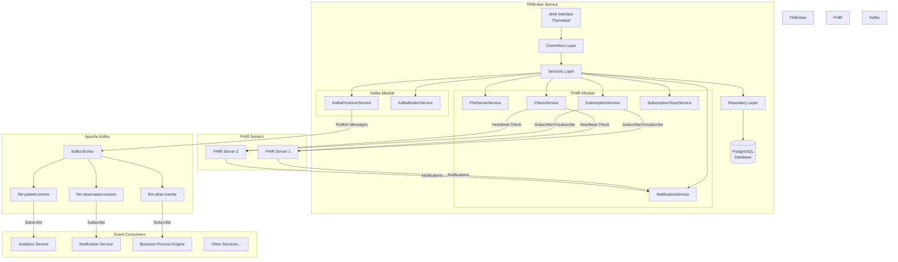
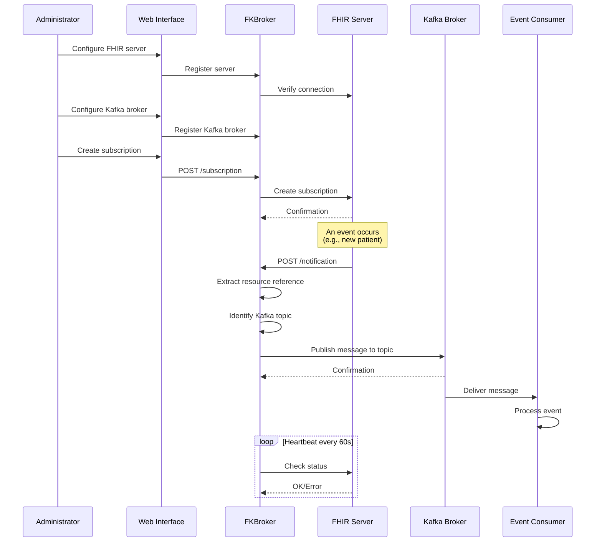

# 🔄 FKBroker Service - FHIR-Kafka Broker

## 📑 Table of Contents
- [📖 Overview](#-overview)
- [🏗️ Architecture](#️-architecture)
- [⚙️ Core Technologies](#️-core-technologies)
- [📁 Project Structure](#-project-structure)
- [✨ Features](#-features)
- [📋 Requirements](#-requirements)
- [🚀 Installation and Configuration](#-installation-and-configuration)
- [💡 Usage](#-usage)
- [🌐 Endpoints](#-endpoints)
- [🔧 Advanced Configuration](#-advanced-configuration)

## 📖 Overview

FKBroker Service is an intermediary service (broker) that facilitates communication between FHIR (Fast Healthcare Interoperability Resources) servers implementing the R5 subscription framework and Apache Kafka for event-driven architecture and real-time data streaming.

This service acts as a bridge between FHIR's event-driven paradigm and Kafka's publish-subscribe messaging system, enabling changes in healthcare resources to be automatically published to Kafka topics for consumption by multiple downstream applications and services.

### 🎯 What Does FKBroker Do?

1. **📝 Manages FHIR Subscriptions**: Creates and maintains subscriptions to events on FHIR servers
2. **📬 Receives Notifications**: Listens for notifications of changes in FHIR resources
3. **🔄 Publishes to Kafka**: Converts FHIR notifications into messages published to Kafka topics
4. **⚡ Event Distribution**: Enables multiple consumers to process healthcare events in real-time
5. **💓 Monitors**: Verifies subscription status through heartbeat checks

## 🏗️ Architecture



### 🔀 Data Flow



## ⚙️ Core Technologies

### 🌱 Main Framework
- **Spring Boot 2.6.15**: Base application framework
  - Spring Web: For REST and MVC endpoints
  - Spring Data JPA: For data persistence
  - Spring Security: For authentication and authorization
  - Spring Kafka: For Kafka integration
  - Thymeleaf: Template engine for web interface

### 🏥 FHIR Integration
- **HAPI FHIR 7.2.0**: Library for working with FHIR R5
  - `hapi-fhir-structures-r5`: FHIR R5 data structures
  - `hapi-fhir-client`: Client for communication with FHIR servers
  - `hapi-fhir-base`: HAPI FHIR base functionalities

### 📨 Kafka Integration
- **Spring Kafka**: Spring integration for Apache Kafka
  - Enables publishing messages to Kafka topics
  - Producer configuration and management
  - Template-based message sending

### 💾 Persistence
- **PostgreSQL**: Main database (recommended for production)
- **H2**: In-memory database (for development and testing)
- **MySQL**: Supported as alternative
- **Hibernate/JPA**: ORM for object-relational mapping

### 🛠️ Other Technologies
- **Jackson 2.17.0**: JSON serialization/deserialization
- **Apache CXF 3.4.10**: Web services framework
- **Swagger/OpenAPI**: REST API documentation
- **SLF4J**: Logging
- **Maven**: Dependency management and build

## 📁 Project Structure

```
fkbroker-service/
│
├── src/main/
│   ├── java/us/dit/fkbroker/service/
│   │   ├── Application.java                    # Main Spring Boot class
│   │   │
│   │   ├── conf/                               # Configuration
│   │   │   ├── BrokerRunner.java              # Broker initialization
│   │   │   ├── DefaultWebSecurityConfig.java   # Security configuration
│   │   │   ├── KafkaConfig.java                # Kafka configuration
│   │   │   ├── SystemPropertiesInjector.java   # Properties injection
│   │   │   └── WebConfiguration.java           # Web configuration
│   │   │
│   │   ├── controllers/                        # Controllers Layer
│   │   │   ├── HomeController.java            # Home page
│   │   │   ├── FhirServerController.java      # FHIR servers management
│   │   │   ├── SubscriptionController.java    # Subscriptions management
│   │   │   ├── SubscriptionTopicController.java # Topics management
│   │   │   ├── NotificationController.java    # Notifications reception
│   │   │   └── MyErrorController.java         # Error handling
│   │   │
│   │   ├── services/                          # Services Layer
│   │   │   ├── FhirService.java              # Main FHIR service
│   │   │   ├── FhirServerService.java        # Server management
│   │   │   ├── SubscriptionService.java      # Subscription management
│   │   │   ├── SubscriptionTopicService.java # Topic management
│   │   │   ├── NotificationService.java      # Notification processing
│   │   │   ├── CheckService.java             # Heartbeat verification
│   │   │   ├── KafkaProducerService.java     # Kafka message publishing
│   │   │   ├── KafkaBrokerService.java       # Kafka broker management
│   │   │   │
│   │   │   └── mapper/                        # DTO-Entity Mappers
│   │   │       ├── SubscriptionMapper.java
│   │   │       ├── SubscriptionTopicMapper.java
│   │   │       └── FhirServerMapper.java
│   │   │
│   │   ├── entities/                          # Entities Layer
│   │   │   ├── db/                            # Database Entities
│   │   │   │   ├── FhirServer.java           # FHIR Server
│   │   │   │   ├── KafkaBroker.java          # Kafka Broker
│   │   │   │   ├── SubscriptionData.java     # Subscription data
│   │   │   │   ├── Topic.java                # FHIR Topic → Kafka Topic
│   │   │   │   └── NotificationBundleData.java # Notification history
│   │   │   │
│   │   │   └── domain/                        # DTOs and domain objects
│   │   │       ├── SubscriptionEntry.java
│   │   │       ├── SubscriptionForm.java
│   │   │       ├── SubscriptionTopicEntry.java
│   │   │       └── SubscriptionTopicDetails.java
│   │   │
│   │   └── repositories/                      # Repositories Layer
│   │       ├── FhirServerRepository.java
│   │       ├── KafkaBrokerRepository.java
│   │       ├── SubscriptionDataRepository.java
│   │       ├── TopicRepository.java
│   │       └── NotificationBundleRepository.java
│   │
│   └── resources/
│       ├── application.properties              # Main configuration
│       ├── application-dev.properties          # Development profile
│       ├── application-postgres.properties     # PostgreSQL profile
│       ├── banner.txt                          # Startup banner
│       │
│       ├── lang/                               # Internationalization
│       │   ├── messages.properties
│       │   ├── messages_es.properties
│       │   └── messages_us.properties
│       │
│       ├── static/                             # Static resources
│       │   ├── access-denied.html
│       │   ├── form-styles.css
│       │   └── img/
│       │
│       └── templates/                          # Thymeleaf templates
│           ├── index.html                      # Main page
│           ├── error.html                      # Error page
│           ├── fhir/                           # FHIR views
│           │   ├── servers.html
│           │   ├── subscriptions-manager.html
│           │   ├── subscription-form.html
│           │   ├── subscription-detail.html
│           │   ├── subscriptiontopic-detail.html
│           │   └── fragments/
│           └── layout/                         # Common fragments
│               ├── header.html
│               └── topnav.html
│
├── pom.xml                                     # Maven configuration
├── LICENSE.txt
└── readme.md
```

## ✨ Features

### 🏥 FHIR Server Management
- ✅ Registration and configuration of multiple FHIR servers
- ✅ Connectivity verification with FHIR servers
- ✅ Support for FHIR R5 (SubscriptionTopic framework)
- ✅ Exploration of available SubscriptionTopics

### 📝 Subscription Management
- ✅ Creation of subscriptions to FHIR events
- ✅ Visualization of active subscriptions
- ✅ Filtering and searching of subscriptions
- ✅ Modification of subscription parameters
- ✅ Deletion of subscriptions
- ✅ Automatic status verification (heartbeat)

### 📬 Notification Processing
- ✅ Reception of FHIR notifications via REST
- ✅ Asynchronous processing of notifications
- ✅ Extraction of relevant data from FHIR bundle
- ✅ Automatic publishing to Kafka topics

### 📨 Kafka Integration
- ✅ Configuration of Kafka broker connection
- ✅ Automatic Kafka topic name generation
- ✅ Publishing of FHIR events to Kafka topics
- ✅ Support for resource reference messages

### 🖥️ Administration Interface
- ✅ Responsive web interface with Thymeleaf
- ✅ Monitoring dashboard
- ✅ Intuitive configuration forms
- ✅ Detailed resource visualization
- ✅ Multi-language support (ES/EN)

### 🔐 Technical Features
- ✅ Persistence in PostgreSQL/MySQL/H2
- ✅ REST API documented with Swagger
- ✅ Configurable logging with SLF4J
- ✅ Security with Spring Security
- ✅ Maven profiles (h2, postgres, mysql, docker, openshift)
- ✅ Externalized configuration

## 📋 Requirements

### 💻 Required Software
- **☕ Java 8 or higher** (JDK 8, 11, 17)
- **📦 Maven 3.6.3 or higher**
- **🐘 PostgreSQL 12 or higher** (recommended for production)
  - Alternatives: MySQL 5.7+, H2 (development only)

### 🌐 External Services
- **🏥 FHIR R5 Server** compatible with SubscriptionTopic framework
  - Example: HAPI FHIR Server 6.0+
- **📨 Apache Kafka** message broker
  - Kafka 2.8+ or compatible

### 🔌 Network Requirements
- Port 8090 available (configurable)
- HTTP/HTTPS connectivity with FHIR servers
- Network connectivity with Kafka broker (default port 9092)

## 🚀 Installation and Configuration

### 1️⃣ Clone the Repository

```bash
git clone https://github.com/tfg-projects-dit-us/FKBroker.git
cd FKBroker/fkbroker-service
```

### 2️⃣ Configure the Database

#### 🐘 Option A: PostgreSQL (Recommended for Production)

```bash
# Create the database
sudo -u postgres createdb fkbroker

# Create user
sudo -u postgres psql
postgres=# CREATE USER fkbroker WITH PASSWORD 'fkbroker';
postgres=# GRANT ALL PRIVILEGES ON DATABASE fkbroker TO fkbroker;
postgres=# \q
```

Configure `src/main/resources/application-postgres.properties`:

```properties
spring.datasource.username=fkbroker
spring.datasource.password=fkbroker
spring.datasource.url=jdbc:postgresql://localhost:5432/fkbroker
spring.datasource.driver-class-name=org.postgresql.Driver
```

#### 💾 Option B: H2 (For Development)

No additional configuration required. The database is automatically created in memory.

### 3️⃣ Configure Application Properties

Edit `src/main/resources/application.properties`:

```properties
# Server port
server.port=8090

# Public broker URL (for FHIR callbacks)
application.address=http://localhost:8090/

# Heartbeat configuration
fhir.subscription.heartbeat.period=60
fhir.subscription.heartbeat.errors=2
fhir.subscription.heartbeat.check.fixed.rate=60000
fhir.subscription.heartbeat.check.initial.delay=60000

# Logging level
logging.level.us.dit.fkbroker=DEBUG
```

### 3️⃣.1 Set Up Kafka Broker (Optional - For Testing)

If you don't have a Kafka broker, you can set up one locally using Docker:

```bash
# Option 1: Single command (simplest)
docker run -d --name kafka -p 9092:9092 apache/kafka:latest

# Option 2: Using docker-compose (recommended for persistence)
# Create a docker-compose.yml file:
version: '3'
services:
  kafka:
    image: apache/kafka:latest
    ports:
      - "9092:9092"
    environment:
      KAFKA_NODE_ID: 1
      KAFKA_PROCESS_ROLES: broker,controller
      KAFKA_LISTENERS: PLAINTEXT://localhost:9092,CONTROLLER://localhost:9093
      KAFKA_ADVERTISED_LISTENERS: PLAINTEXT://localhost:9092
      KAFKA_CONTROLLER_LISTENER_NAMES: CONTROLLER
      KAFKA_LISTENER_SECURITY_PROTOCOL_MAP: CONTROLLER:PLAINTEXT,PLAINTEXT:PLAINTEXT
      KAFKA_CONTROLLER_QUORUM_VOTERS: 1@localhost:9093
      KAFKA_OFFSETS_TOPIC_REPLICATION_FACTOR: 1
      KAFKA_TRANSACTION_STATE_LOG_REPLICATION_FACTOR: 1
      KAFKA_TRANSACTION_STATE_LOG_MIN_ISR: 1
      KAFKA_GROUP_INITIAL_REBALANCE_DELAY_MS: 0
      KAFKA_NUM_PARTITIONS: 3

# Start Kafka
docker-compose up -d
```

The Kafka broker connection will be configured in the database after the application starts:

```sql
-- Example: Configure Kafka broker in database
INSERT INTO kafka_broker (id, name, bootstrap_servers) 
VALUES (1, 'Local Kafka', 'localhost:9092');
```

### 4️⃣ Build and Run

#### 🐘 With PostgreSQL:

```bash
mvn clean install
mvn spring-boot:run -Ppostgres
```

#### 💾 With H2 (development):

```bash
mvn clean install
mvn spring-boot:run
```

#### 🐬 With MySQL:

```bash
mvn clean install
mvn spring-boot:run -Pmysql
```

### 5️⃣ Access the Application

Open browser at: `http://localhost:8090`

## 💡 Usage

### 🔄 Typical Workflow

1. **🏥 Configure FHIR Server**
   - Go to "FHIR Servers" → "Add Server"
   - Enter name, base URL, and description
   - Verify connectivity

2. **📚 Explore SubscriptionTopics**
   - Select FHIR server
   - View available topics
   - Examine details of each topic

3. **📨 Configure Kafka Broker**
   - Configure Kafka broker connection in database or via web interface
   - Set bootstrap servers (e.g., `localhost:9092`)
   - Verify connectivity

4. **📝 Create Subscription**
   - Select FHIR topic
   - Kafka topic name will be auto-generated
   - Configure optional filters
   - Activate subscription

5. **📊 Monitor**
   - View active subscriptions
   - Verify heartbeat status
   - Review notification logs
   - Monitor Kafka topics for published messages

### 🔀 FHIR to Kafka Topic Mapping

FKBroker automatically generates Kafka topic names from FHIR SubscriptionTopic IDs:

**Mapping Rules:**
- FHIR Topic ID format: `http://example.org/SubscriptionTopic/patient-create` or just `patient-create`
- Kafka Topic Name format: `fhir-{normalized-id}`
- Normalization: Lowercase, special characters replaced with hyphens

**Examples:**
```
FHIR Topic ID                              → Kafka Topic Name
───────────────────────────────────────────────────────────────
patient-create                             → fhir-patient-create
observation-vital-signs                    → fhir-observation-vital-signs
SubscriptionTopic/encounter-admission      → fhir-encounter-admission
http://example.org/patient-update          → fhir-patient-update
```

**Message Format:**
When a FHIR notification is received, FKBroker publishes a message containing the resource reference:
```json
"Patient/12345"
"Observation/67890"
"Encounter/abc-123"
```

Downstream Kafka consumers can use these resource IDs to fetch the full resource from the FHIR server if needed.

## 🌐 Endpoints

### 🔌 REST API

#### 🏥 FHIR Server Management
```
GET    /fhir/servers              # List servers
POST   /fhir/servers              # Create server
GET    /fhir/servers/{id}         # Get server
PUT    /fhir/servers/{id}         # Update server
DELETE /fhir/servers/{id}         # Delete server
```

#### 📝 Subscription Management
```
GET    /fhir/subscriptions        # List subscriptions
POST   /fhir/subscriptions        # Create subscription
GET    /fhir/subscriptions/{id}   # Get subscription
PUT    /fhir/subscriptions/{id}   # Update subscription
DELETE /fhir/subscriptions/{id}   # Delete subscription
```

#### 📬 Notification Reception
```
POST   /notification              # Receive FHIR notification
```

#### 📨 Kafka Broker Management
```
GET    /kafka/brokers             # List brokers (future)
POST   /kafka/brokers             # Create broker (future)
GET    /kafka/brokers/{id}        # Get broker (future)
DELETE /kafka/brokers/{id}        # Delete broker (future)
```

### 🖥️ Web Interface

```
GET    /                          # Home page
GET    /fhir/servers              # FHIR server management
GET    /fhir/subscriptions        # Subscription management
GET    /error                     # Error page
```

## 🔧 Advanced Configuration

### 💓 Heartbeat Customization

```properties
# Heartbeat period in seconds (0 = no heartbeat)
fhir.subscription.heartbeat.period=60

# Number of errors before deactivating subscription
fhir.subscription.heartbeat.errors=2

# Check interval in milliseconds
fhir.subscription.heartbeat.check.fixed.rate=60000

# Initial delay before first check
fhir.subscription.heartbeat.check.initial.delay=60000
```

### � Kafka Configuration

```properties
# Kafka broker connection (stored in database)
# Can be configured via web interface or directly in database:
# INSERT INTO kafka_broker (name, bootstrap_servers) 
# VALUES ('Main Broker', 'localhost:9092');

# Kafka topic naming pattern:
# Generated automatically as: fhir-{normalized-topic-id}
# Example: SubscriptionTopic/patient-create → fhir-patient-create
```

### �📝 Logging Configuration

```properties
# General level
logging.level.root=INFO

# FKBroker level
logging.level.us.dit.fkbroker=DEBUG

# Spring Security level
logging.level.org.springframework.security=DEBUG

# HAPI FHIR level
logging.level.ca.uhn.fhir=INFO

# Kafka level
logging.level.org.springframework.kafka=INFO
```

### 📦 Maven Profiles

```bash
# Development with H2
mvn spring-boot:run

# Production with PostgreSQL
mvn spring-boot:run -Ppostgres

# Production with MySQL
mvn spring-boot:run -Pmysql

# Docker image build
mvn clean install -Pdocker

# OpenShift deployment
mvn clean install -Popenshift
```

### 🌍 Environment Variables

Properties can be overridden using environment variables:

```bash
export SERVER_PORT=9090
export SPRING_DATASOURCE_URL=jdbc:postgresql://db-server:5432/fkbroker
export SPRING_DATASOURCE_USERNAME=username
export SPRING_DATASOURCE_PASSWORD=password
export APPLICATION_ADDRESS=http://fkbroker.example.com:9090/
```

### 🔐 Security

Security configuration is located in `SecurityConfiguration.java`. By default:

- HTTP Basic authentication enabled
- All endpoints protected except `/notification`
- Default user: `admin` / `admin` (change in production)

To customize, edit the configuration class or use Spring Security properties.

#### ⚠️ WARNING: Configuration NOT Suitable for Production

The current security configuration is **FOR DEVELOPMENT AND TESTING ONLY**. It presents the following critical vulnerabilities:

**🚨 Current Security Issues:**

1. **Hardcoded Credentials**
   - Default username and password (`admin`/`admin`) publicly known
   - Passwords in plain text in source code
   - High risk of unauthorized access

2. **HTTP Basic Authentication**
   - Credentials sent in Base64 (easily decodable)
   - No protection against man-in-the-middle attacks without HTTPS
   - Does not comply with modern security standards

3. **Unprotected `/notification` Endpoint**
   - Anyone can send fake notifications
   - No validation of FHIR request origin
   - Risk of denial of service (DoS) attacks
   - Possible malicious data injection

4. **Lack of HTTPS/TLS**
   - Communications in plain text
   - Credentials and sensitive data exposed in transit
   - Vulnerability to traffic interception

5. **No Session Management**
   - No control over active sessions
   - No session timeout
   - No CSRF protection

6. **No Auditing**
   - No access logging
   - No traceability of critical operations
   - Impossible to detect unauthorized access

#### 🛡️ Required Efforts for Production

To bring this service to a secure production environment, the following improvements are required:

**1. 🔑 Implement Robust Authentication and Authorization (Effort: High)**

```properties
# Recommended options:
- OAuth 2.0 / OpenID Connect
- JSON Web Tokens (JWT)
- Integration with identity providers (Azure AD, Keycloak, Auth0)
- LDAP/Active Directory for enterprise environments
```

**Tasks:**
- Configure OAuth 2.0 authorization server
- Implement appropriate authorization flow
- Manage access and refresh tokens
- Define granular scopes and permissions
- **Estimated time:** 2-3 weeks

**2. 🔒 Enable HTTPS/TLS (Effort: Medium)**

```bash
# Required configuration:
server.port=8443
server.ssl.enabled=true
server.ssl.key-store=classpath:keystore.p12
server.ssl.key-store-password=${KEYSTORE_PASSWORD}
server.ssl.key-store-type=PKCS12
server.ssl.key-alias=fkbroker
```

**Tasks:**
- Obtain valid SSL/TLS certificates
- Configure keystore and truststore
- Implement automatic certificate renewal
- Force HTTP → HTTPS redirection
- **Estimated time:** 1 week

**3. 🔐 Protect Notification Endpoint (Effort: High)**

**Security options:**

a) **Signature Validation (Recommended for FHIR)**
```java
// Validate digital signature from authorized FHIR servers
- Implement whitelist of authorized FHIR servers
- Validate certificates or digital signatures
- Verify specific authentication headers
```

b) **API Keys per FHIR Server**
```java
// Each FHIR server has its unique API key
- Generate cryptographically secure API keys
- Rotate keys periodically
- Validate API key in each notification
```

c) **Mutual TLS (mTLS)**
```java
// Bidirectional certificate-based authentication
- Configure client certificates for FHIR servers
- Validate certificates on each connection
```

**Tasks:**
- Implement chosen validation mechanism
- Create database of authorized servers
- Implement rate limiting
- Add payload validation
- **Estimated time:** 2-4 weeks

**4. 👥 User and Role Management (Effort: Medium)**

```java
// Define roles and permissions
ROLE_ADMIN: All operations
ROLE_OPERATOR: Subscription and server management
ROLE_VIEWER: Read-only access
ROLE_API: Limited programmatic access
```

**Tasks:**
- Design role and permission model
- Implement Role-Based Access Control (RBAC)
- Create user management interface
- Integrate with corporate identity system
- **Estimated time:** 2 weeks

**5. 🔍 Implement Security Auditing and Logging (Effort: Medium)**

```java
// Events to audit:
- Login attempts (successful and failed)
- Subscription creation/modification/deletion
- Server configuration changes
- Received notifications (origin, timestamp, result)
- Messages published to Kafka topics
- Denied access
```

**Tasks:**
- Implement auditing framework
- Configure secure log storage
- Implement security alerts
- Comply with GDPR/applicable regulations
- **Estimated time:** 1-2 weeks

**6. 🛡️ Protection Against Common Attacks (Effort: Medium)**

**Implement:**
- **CSRF Protection**: Anti-CSRF tokens in forms
- **Rate Limiting**: Limit requests per IP/user
- **Input Validation**: Strict validation of all inputs
- **SQL Injection Protection**: Use PreparedStatements (already implemented with JPA)
- **XSS Protection**: Sanitize outputs in Thymeleaf
- **Security Headers**: HSTS, X-Frame-Options, CSP, etc.

```java
// Recommended security headers:
Strict-Transport-Security: max-age=31536000; includeSubDomains
X-Content-Type-Options: nosniff
X-Frame-Options: DENY
X-XSS-Protection: 1; mode=block
Content-Security-Policy: default-src 'self'
```

**Tasks:**
- Configure Spring Security filters
- Implement custom validators
- Configure security headers
- **Estimated time:** 1-2 weeks

**7. 🔐 Secure Secret Management (Effort: Medium)**

**Never in source code:**
- Database passwords
- API keys
- Private certificates
- External server credentials

**Recommended solutions:**
```bash
# Options by environment:
- HashiCorp Vault
- Azure Key Vault
- AWS Secrets Manager
- Kubernetes Secrets (if using K8s)
- Encrypted environment variables
```

**Tasks:**
- Select secret management solution
- Migrate all credentials
- Implement automatic rotation
- Configure role-based access
- **Estimated time:** 1-2 weeks

**8. 🔄 Updates and Maintenance (Effort: Continuous)**

**Tasks:**
- Monitor dependency CVEs (use OWASP Dependency Check)
- Update libraries regularly
- Perform periodic security audits
- Implement security pipeline in CI/CD
- **Estimated time:** Continuous

#### 📊 Total Effort Summary

| Component | Effort | Priority | Estimated Time |
|-----------|--------|----------|----------------|
| OAuth 2.0 / JWT | High | 🔴 Critical | 2-3 weeks |
| HTTPS/TLS | Medium | 🔴 Critical | 1 week |
| Notification Protection | High | 🔴 Critical | 2-4 weeks |
| User/Role Management | Medium | 🟡 High | 2 weeks |
| Auditing and Logging | Medium | 🟡 High | 1-2 weeks |
| Attack Protection | Medium | 🟡 High | 1-2 weeks |
| Secret Management | Medium | 🟠 Medium | 1-2 weeks |
| Continuous Maintenance | Low | 🟢 Continuous | Continuous |

**⏱️ Total Estimated Time: 10-16 weeks** (2.5-4 months with a dedicated developer)

**💰 Additional Resources Required:**
- Senior developer with security experience
- Authentication/authorization server
- Valid SSL/TLS certificates
- Secret management service
- Security monitoring tools
- Possible external security consultancy

#### 🎯 Recommended Production Roadmap

**Phase 1 - Basic Security (Critical):**
1. Implement HTTPS/TLS
2. Change default credentials
3. Protect `/notification` endpoint
4. Implement basic secret management

**Phase 2 - Robust Authentication:**
1. Implement OAuth 2.0/JWT
2. Integrate with identity provider
3. Implement RBAC

**Phase 3 - Fortification:**
1. Complete auditing and logging
2. Common attack protection
3. Security headers

**Phase 4 - Maintenance:**
1. Continuous monitoring
2. Security updates
3. Periodic audits

---

## 🤝 Support and Contributions

To report bugs, request features, or contribute to the project, visit the [main repository](https://github.com/tfg-projects-dit-us/FKBroker).

## 📄 License

This project is licensed under GPL v3. See `LICENSE.txt` for more details.
