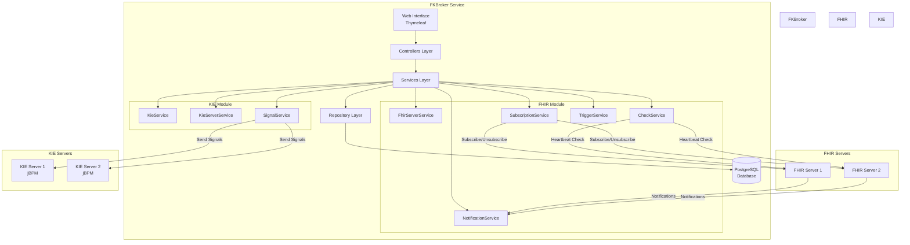
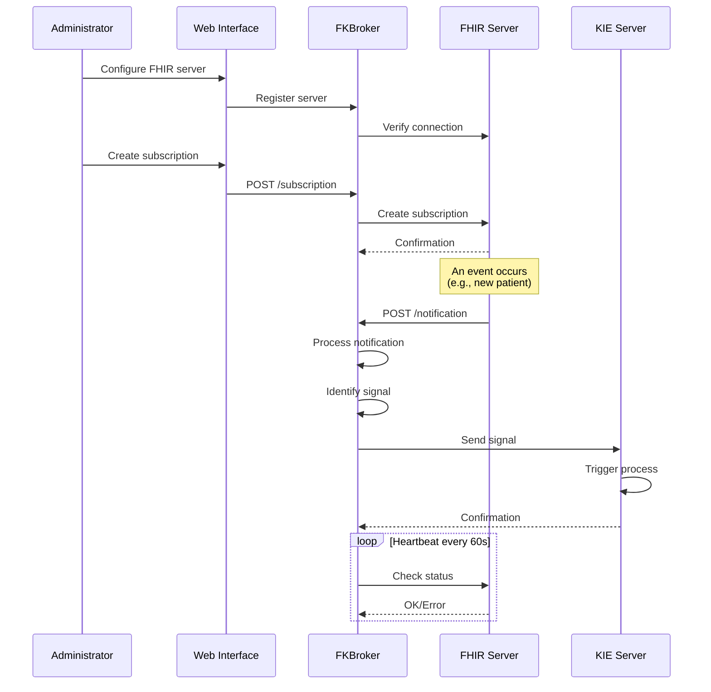

# 🔄 FKBroker Service - FHIR-KIE Broker

## 📑 Table of Contents
- [📖 Overview](#-overview)
- [🏗️ Architecture](#️-architecture)
- [⚙️ Core Technologies](#️-core-technologies)
- [📁 Project Structure](#-project-structure)
- [✨ Features](#-features)
- [📋 Requirements](#-requirements)
- [🚀 Installation and Configuration](#-installation-and-configuration)
- [💡 Usage](#-usage)
- [🌐 Endpoints](#-endpoints)
- [🔧 Advanced Configuration](#-advanced-configuration)

## 📖 Overview

FKBroker Service is an intermediary service (broker) that facilitates indirect communication between FHIR (Fast Healthcare Interoperability Resources) servers implementing the R5 subscription framework and KIE (Knowledge Is Everything) servers for business process execution.

This service acts as a bridge between FHIR's event-driven paradigm and the jBPM process engine, enabling changes in healthcare resources to automatically inform business processes defined in jBPM.

### 🎯 What Does FKBroker Do?

1. **📝 Manages FHIR Subscriptions**: Creates and maintains subscriptions to events on FHIR servers
2. **📬 Receives Notifications**: Listens for notifications of changes in FHIR resources
3. **🔄 Translates Events**: Converts FHIR notifications into signals understandable by jBPM
4. **⚡ Triggers Processes**: Sends signals to KIE servers to initiate or continue business processes
5. **💓 Monitors**: Verifies subscription status through heartbeat checks

## 🏗️ Architecture



### 🔀 Data Flow



## ⚙️ Core Technologies

### 🌱 Main Framework
- **Spring Boot 2.6.15**: Base application framework
  - Spring Web: For REST and MVC endpoints
  - Spring Data JPA: For data persistence
  - Spring Security: For authentication and authorization
  - Thymeleaf: Template engine for web interface

### 🏥 FHIR Integration
- **HAPI FHIR 7.2.0**: Library for working with FHIR R5
  - `hapi-fhir-structures-r5`: FHIR R5 data structures
  - `hapi-fhir-client`: Client for communication with FHIR servers
  - `hapi-fhir-base`: HAPI FHIR base functionalities

### 🧠 KIE/jBPM Integration
- **KIE Server Client 7.74.1.Final**: Client for communication with jBPM servers
  - Enables sending signals to processes
  - KIE container management
  - Interaction with jBPM REST API

### 💾 Persistence
- **PostgreSQL**: Main database (recommended for production)
- **H2**: In-memory database (for development and testing)
- **MySQL**: Supported as alternative
- **Hibernate/JPA**: ORM for object-relational mapping

### 🛠️ Other Technologies
- **Jackson 2.17.0**: JSON serialization/deserialization
- **Apache CXF 3.4.10**: Web services framework
- **Swagger/OpenAPI**: REST API documentation
- **SLF4J**: Logging
- **Maven**: Dependency management and build

## 📁 Project Structure

```
fkbroker-service/
│
├── src/main/
│   ├── java/us/dit/fkbroker/service/
│   │   ├── Application.java                    # Main Spring Boot class
│   │   │
│   │   ├── conf/                               # Configuration
│   │   │   ├── BrokerRunner.java              # Broker initialization
│   │   │   ├── SecurityConfiguration.java      # Security configuration
│   │   │   └── SystemPropertiesInjector.java   # Properties injection
│   │   │
│   │   ├── controllers/                        # Controllers Layer
│   │   │   ├── HomeController.java            # Home page
│   │   │   ├── FhirServerController.java      # FHIR servers management
│   │   │   ├── KieController.java             # KIE servers management
│   │   │   ├── SubscriptionController.java    # Subscriptions management
│   │   │   ├── SubscriptionTopicController.java # Topics management
│   │   │   ├── NotificationController.java    # Notifications reception
│   │   │   └── MyErrorController.java         # Error handling
│   │   │
│   │   ├── services/                          # Services Layer
│   │   │   ├── fhir/                          # FHIR Services
│   │   │   │   ├── FhirService.java          # Main FHIR service
│   │   │   │   ├── FhirServerService.java    # Server management
│   │   │   │   ├── SubscriptionService.java  # Subscription management
│   │   │   │   ├── SubscriptionTopicService.java # Topic management
│   │   │   │   ├── NotificationService.java  # Notification processing
│   │   │   │   ├── CheckService.java         # Heartbeat verification
│   │   │   │   └── TriggerService.java       # Trigger management
│   │   │   │
│   │   │   ├── kie/                           # KIE Services
│   │   │   │   ├── KieService.java           # Main KIE service
│   │   │   │   ├── KieServerService.java     # KIE server management
│   │   │   │   └── SignalService.java        # Signal sending
│   │   │   │
│   │   │   └── mapper/                        # DTO-Entity Mappers
│   │   │       ├── SubscriptionMapper.java
│   │   │       ├── SubscriptionTopicMapper.java
│   │   │       └── SignalMapper.java
│   │   │
│   │   ├── entities/                          # Entities Layer
│   │   │   ├── db/                            # Database Entities
│   │   │   │   ├── FhirServer.java           # FHIR Server
│   │   │   │   ├── KieServer.java            # KIE Server
│   │   │   │   ├── Signal.java               # KIE Signal
│   │   │   │   ├── SubscriptionData.java     # Subscription data
│   │   │   │   ├── Topic.java                # FHIR Topic
│   │   │   │   └── Trigger.java              # Subscription trigger
│   │   │   │
│   │   │   └── domain/                        # DTOs and domain objects
│   │   │       ├── SubscriptionEntry.java
│   │   │       ├── SubscriptionForm.java
│   │   │       ├── SubscriptionTopicEntry.java
│   │   │       ├── SubscriptionTopicDetails.java
│   │   │       └── SignalDetails.java
│   │   │
│   │   └── repositories/                      # Repositories Layer
│   │       ├── FhirServerRepository.java
│   │       ├── KieServerRepository.java
│   │       ├── SignalRepository.java
│   │       ├── SubscriptionDataRepository.java
│   │       ├── TopicRepository.java
│   │       └── TriggerRepository.java
│   │
│   └── resources/
│       ├── application.properties              # Main configuration
│       ├── application-dev.properties          # Development profile
│       ├── application-postgres.properties     # PostgreSQL profile
│       ├── banner.txt                          # Startup banner
│       │
│       ├── lang/                               # Internationalization
│       │   ├── messages.properties
│       │   ├── messages_es.properties
│       │   └── messages_us.properties
│       │
│       ├── static/                             # Static resources
│       │   ├── access-denied.html
│       │   ├── form-styles.css
│       │   └── img/
│       │
│       └── templates/                          # Thymeleaf templates
│           ├── index.html                      # Main page
│           ├── error.html                      # Error page
│           ├── fhir/                           # FHIR views
│           │   ├── servers.html
│           │   ├── subscriptions-manager.html
│           │   ├── subscription-form.html
│           │   ├── subscription-detail.html
│           │   ├── subscriptiontopic-detail.html
│           │   └── fragments/
│           ├── kie/                            # KIE views
│           │   └── kie-manager.html
│           └── layout/                         # Common fragments
│               ├── header.html
│               └── topnav.html
│
├── pom.xml                                     # Maven configuration
├── LICENSE.txt
└── readme.md
```

## ✨ Features

### 🏥 FHIR Server Management
- ✅ Registration and configuration of multiple FHIR servers
- ✅ Connectivity verification with FHIR servers
- ✅ Support for FHIR R5 (SubscriptionTopic framework)
- ✅ Exploration of available SubscriptionTopics

### 📝 Subscription Management
- ✅ Creation of subscriptions to FHIR events
- ✅ Visualization of active subscriptions
- ✅ Filtering and searching of subscriptions
- ✅ Modification of subscription parameters
- ✅ Deletion of subscriptions
- ✅ Automatic status verification (heartbeat)

### 📬 Notification Processing
- ✅ Reception of FHIR notifications via REST
- ✅ Asynchronous processing of notifications
- ✅ Extraction of relevant data from FHIR bundle
- ✅ Mapping of notifications to KIE signals

### 🧠 KIE Server Management
- ✅ Registration of KIE/jBPM servers
- ✅ Configuration of KIE containers
- ✅ Credential and authentication management

### ⚡ Signal Sending
- ✅ Configuration of custom signals
- ✅ Mapping of FHIR events to jBPM signals
- ✅ Automatic signal sending after notifications
- ✅ Support for signals with data (payloads)

### 🖥️ Administration Interface
- ✅ Responsive web interface with Thymeleaf
- ✅ Monitoring dashboard
- ✅ Intuitive configuration forms
- ✅ Detailed resource visualization
- ✅ Multi-language support (ES/EN)

### 🔐 Technical Features
- ✅ Persistence in PostgreSQL/MySQL/H2
- ✅ REST API documented with Swagger
- ✅ Configurable logging with SLF4J
- ✅ Security with Spring Security
- ✅ Maven profiles (h2, postgres, mysql, docker, openshift)
- ✅ Externalized configuration

## 📋 Requirements

### 💻 Required Software
- **☕ Java 8 or higher** (JDK 8, 11, 17)
- **📦 Maven 3.6.3 or higher**
- **🐘 PostgreSQL 12 or higher** (recommended for production)
  - Alternatives: MySQL 5.7+, H2 (development only)

### 🌐 External Services
- **🏥 FHIR R5 Server** compatible with SubscriptionTopic framework
  - Example: HAPI FHIR Server 6.0+
- **🧠 KIE Server (jBPM) 7.74+** with deployed containers

### 🔌 Network Requirements
- Port 8090 available (configurable)
- HTTP/HTTPS connectivity with FHIR servers
- HTTP/HTTPS connectivity with KIE servers

## 🚀 Installation and Configuration

### 1️⃣ Clone the Repository

```bash
git clone https://github.com/tfg-projects-dit-us/FKBroker.git
cd FKBroker/fkbroker-service
```

### 2️⃣ Configure the Database

#### 🐘 Option A: PostgreSQL (Recommended for Production)

```bash
# Create the database
sudo -u postgres createdb fkbroker

# Create user
sudo -u postgres psql
postgres=# CREATE USER jbpm WITH PASSWORD 'jbpm';
postgres=# GRANT ALL PRIVILEGES ON DATABASE fkbroker TO jbpm;
postgres=# \q
```

Configure `src/main/resources/application-postgres.properties`:

```properties
spring.datasource.username=jbpm
spring.datasource.password=jbpm
spring.datasource.url=jdbc:postgresql://localhost:5432/fkbroker
spring.datasource.driver-class-name=org.postgresql.Driver
```

#### 💾 Option B: H2 (For Development)

No additional configuration required. The database is automatically created in memory.

### 3️⃣ Configure the Service

Edit `src/main/resources/application.properties`:

```properties
# Server port
server.port=8090

# Public broker URL (for FHIR callbacks)
application.address=http://localhost:8090/

# Heartbeat configuration
fhir.subscription.heartbeat.period=60
fhir.subscription.heartbeat.errors=2
fhir.subscription.heartbeat.check.fixed.rate=60000
fhir.subscription.heartbeat.check.initial.delay=60000

# Logging level
logging.level.us.dit.fkbroker=DEBUG
```

### 4️⃣ Build and Run

#### 🐘 With PostgreSQL:

```bash
mvn clean install
mvn spring-boot:run -Ppostgres
```

#### 💾 With H2 (development):

```bash
mvn clean install
mvn spring-boot:run
```

#### 🐬 With MySQL:

```bash
mvn clean install
mvn spring-boot:run -Pmysql
```

### 5️⃣ Access the Application

Open browser at: `http://localhost:8090`

## 💡 Usage

### 🔄 Typical Workflow

1. **🏥 Configure FHIR Server**
   - Go to "FHIR Servers" → "Add Server"
   - Enter name, base URL, and description
   - Verify connectivity

2. **📚 Explore SubscriptionTopics**
   - Select FHIR server
   - View available topics
   - Examine details of each topic

3. **🧠 Configure KIE Server**
   - Go to "KIE Servers" → "Add Server"
   - Configure URL, credentials, and container

4. **⚡ Create Signal**
   - Define signal name
   - Specify target KIE server
   - Configure payload if needed

5. **📝 Create Subscription**
   - Select FHIR topic
   - Associate KIE signal
   - Configure optional filters
   - Activate subscription

6. **📊 Monitor**
   - View active subscriptions
   - Verify heartbeat status
   - Review notification logs

## 🌐 Endpoints

### 🔌 REST API

#### 🏥 FHIR Server Management
```
GET    /fhir/servers              # List servers
POST   /fhir/servers              # Create server
GET    /fhir/servers/{id}         # Get server
PUT    /fhir/servers/{id}         # Update server
DELETE /fhir/servers/{id}         # Delete server
```

#### 📝 Subscription Management
```
GET    /fhir/subscriptions        # List subscriptions
POST   /fhir/subscriptions        # Create subscription
GET    /fhir/subscriptions/{id}   # Get subscription
PUT    /fhir/subscriptions/{id}   # Update subscription
DELETE /fhir/subscriptions/{id}   # Delete subscription
```

#### 📬 Notification Reception
```
POST   /notification              # Receive FHIR notification
```

#### 🧠 KIE Server Management
```
GET    /kie/servers               # List servers
POST   /kie/servers               # Create server
GET    /kie/servers/{id}          # Get server
DELETE /kie/servers/{id}          # Delete server
```

#### ⚡ Signal Management
```
GET    /kie/signals               # List signals
POST   /kie/signals               # Create signal
GET    /kie/signals/{id}          # Get signal
DELETE /kie/signals/{id}          # Delete signal
```

### 🖥️ Web Interface

```
GET    /                          # Home page
GET    /fhir/servers              # FHIR server management
GET    /fhir/subscriptions        # Subscription management
GET    /kie/manager               # KIE management
GET    /error                     # Error page
```

## 🔧 Advanced Configuration

### 💓 Heartbeat Customization

```properties
# Heartbeat period in seconds (0 = no heartbeat)
fhir.subscription.heartbeat.period=60

# Number of errors before deactivating subscription
fhir.subscription.heartbeat.errors=2

# Check interval in milliseconds
fhir.subscription.heartbeat.check.fixed.rate=60000

# Initial delay before first check
fhir.subscription.heartbeat.check.initial.delay=60000
```

### 📝 Logging Configuration

```properties
# General level
logging.level.root=INFO

# FKBroker level
logging.level.us.dit.fkbroker=DEBUG

# Spring Security level
logging.level.org.springframework.security=DEBUG

# HAPI FHIR level
logging.level.ca.uhn.fhir=INFO
```

### 📦 Maven Profiles

```bash
# Development with H2
mvn spring-boot:run

# Production with PostgreSQL
mvn spring-boot:run -Ppostgres

# Production with MySQL
mvn spring-boot:run -Pmysql

# Docker image build
mvn clean install -Pdocker

# OpenShift deployment
mvn clean install -Popenshift
```

### 🌍 Environment Variables

Properties can be overridden using environment variables:

```bash
export SERVER_PORT=9090
export SPRING_DATASOURCE_URL=jdbc:postgresql://db-server:5432/fkbroker
export SPRING_DATASOURCE_USERNAME=username
export SPRING_DATASOURCE_PASSWORD=password
export APPLICATION_ADDRESS=http://fkbroker.example.com:9090/
```

### 🔐 Security

Security configuration is located in `SecurityConfiguration.java`. By default:

- HTTP Basic authentication enabled
- All endpoints protected except `/notification`
- Default user: `admin` / `admin` (change in production)

To customize, edit the configuration class or use Spring Security properties.

#### ⚠️ WARNING: Configuration NOT Suitable for Production

The current security configuration is **FOR DEVELOPMENT AND TESTING ONLY**. It presents the following critical vulnerabilities:

**🚨 Current Security Issues:**

1. **Hardcoded Credentials**
   - Default username and password (`admin`/`admin`) publicly known
   - Passwords in plain text in source code
   - High risk of unauthorized access

2. **HTTP Basic Authentication**
   - Credentials sent in Base64 (easily decodable)
   - No protection against man-in-the-middle attacks without HTTPS
   - Does not comply with modern security standards

3. **Unprotected `/notification` Endpoint**
   - Anyone can send fake notifications
   - No validation of FHIR request origin
   - Risk of denial of service (DoS) attacks
   - Possible malicious data injection

4. **Lack of HTTPS/TLS**
   - Communications in plain text
   - Credentials and sensitive data exposed in transit
   - Vulnerability to traffic interception

5. **No Session Management**
   - No control over active sessions
   - No session timeout
   - No CSRF protection

6. **No Auditing**
   - No access logging
   - No traceability of critical operations
   - Impossible to detect unauthorized access

#### 🛡️ Required Efforts for Production

To bring this service to a secure production environment, the following improvements are required:

**1. 🔑 Implement Robust Authentication and Authorization (Effort: High)**

```properties
# Recommended options:
- OAuth 2.0 / OpenID Connect
- JSON Web Tokens (JWT)
- Integration with identity providers (Azure AD, Keycloak, Auth0)
- LDAP/Active Directory for enterprise environments
```

**Tasks:**
- Configure OAuth 2.0 authorization server
- Implement appropriate authorization flow
- Manage access and refresh tokens
- Define granular scopes and permissions
- **Estimated time:** 2-3 weeks

**2. 🔒 Enable HTTPS/TLS (Effort: Medium)**

```bash
# Required configuration:
server.port=8443
server.ssl.enabled=true
server.ssl.key-store=classpath:keystore.p12
server.ssl.key-store-password=${KEYSTORE_PASSWORD}
server.ssl.key-store-type=PKCS12
server.ssl.key-alias=fkbroker
```

**Tasks:**
- Obtain valid SSL/TLS certificates
- Configure keystore and truststore
- Implement automatic certificate renewal
- Force HTTP → HTTPS redirection
- **Estimated time:** 1 week

**3. 🔐 Protect Notification Endpoint (Effort: High)**

**Security options:**

a) **Signature Validation (Recommended for FHIR)**
```java
// Validate digital signature from authorized FHIR servers
- Implement whitelist of authorized FHIR servers
- Validate certificates or digital signatures
- Verify specific authentication headers
```

b) **API Keys per FHIR Server**
```java
// Each FHIR server has its unique API key
- Generate cryptographically secure API keys
- Rotate keys periodically
- Validate API key in each notification
```

c) **Mutual TLS (mTLS)**
```java
// Bidirectional certificate-based authentication
- Configure client certificates for FHIR servers
- Validate certificates on each connection
```

**Tasks:**
- Implement chosen validation mechanism
- Create database of authorized servers
- Implement rate limiting
- Add payload validation
- **Estimated time:** 2-4 weeks

**4. 👥 User and Role Management (Effort: Medium)**

```java
// Define roles and permissions
ROLE_ADMIN: All operations
ROLE_OPERATOR: Subscription and server management
ROLE_VIEWER: Read-only access
ROLE_API: Limited programmatic access
```

**Tasks:**
- Design role and permission model
- Implement Role-Based Access Control (RBAC)
- Create user management interface
- Integrate with corporate identity system
- **Estimated time:** 2 weeks

**5. 🔍 Implement Security Auditing and Logging (Effort: Medium)**

```java
// Events to audit:
- Login attempts (successful and failed)
- Subscription creation/modification/deletion
- Server configuration changes
- Received notifications (origin, timestamp, result)
- Signals sent to KIE servers
- Denied access
```

**Tasks:**
- Implement auditing framework
- Configure secure log storage
- Implement security alerts
- Comply with GDPR/applicable regulations
- **Estimated time:** 1-2 weeks

**6. 🛡️ Protection Against Common Attacks (Effort: Medium)**

**Implement:**
- **CSRF Protection**: Anti-CSRF tokens in forms
- **Rate Limiting**: Limit requests per IP/user
- **Input Validation**: Strict validation of all inputs
- **SQL Injection Protection**: Use PreparedStatements (already implemented with JPA)
- **XSS Protection**: Sanitize outputs in Thymeleaf
- **Security Headers**: HSTS, X-Frame-Options, CSP, etc.

```java
// Recommended security headers:
Strict-Transport-Security: max-age=31536000; includeSubDomains
X-Content-Type-Options: nosniff
X-Frame-Options: DENY
X-XSS-Protection: 1; mode=block
Content-Security-Policy: default-src 'self'
```

**Tasks:**
- Configure Spring Security filters
- Implement custom validators
- Configure security headers
- **Estimated time:** 1-2 weeks

**7. 🔐 Secure Secret Management (Effort: Medium)**

**Never in source code:**
- Database passwords
- API keys
- Private certificates
- External server credentials

**Recommended solutions:**
```bash
# Options by environment:
- HashiCorp Vault
- Azure Key Vault
- AWS Secrets Manager
- Kubernetes Secrets (if using K8s)
- Encrypted environment variables
```

**Tasks:**
- Select secret management solution
- Migrate all credentials
- Implement automatic rotation
- Configure role-based access
- **Estimated time:** 1-2 weeks

**8. 🔄 Updates and Maintenance (Effort: Continuous)**

**Tasks:**
- Monitor dependency CVEs (use OWASP Dependency Check)
- Update libraries regularly
- Perform periodic security audits
- Implement security pipeline in CI/CD
- **Estimated time:** Continuous

#### 📊 Total Effort Summary

| Component | Effort | Priority | Estimated Time |
|-----------|--------|----------|----------------|
| OAuth 2.0 / JWT | High | 🔴 Critical | 2-3 weeks |
| HTTPS/TLS | Medium | 🔴 Critical | 1 week |
| Notification Protection | High | 🔴 Critical | 2-4 weeks |
| User/Role Management | Medium | 🟡 High | 2 weeks |
| Auditing and Logging | Medium | 🟡 High | 1-2 weeks |
| Attack Protection | Medium | 🟡 High | 1-2 weeks |
| Secret Management | Medium | 🟠 Medium | 1-2 weeks |
| Continuous Maintenance | Low | 🟢 Continuous | Continuous |

**⏱️ Total Estimated Time: 10-16 weeks** (2.5-4 months with a dedicated developer)

**💰 Additional Resources Required:**
- Senior developer with security experience
- Authentication/authorization server
- Valid SSL/TLS certificates
- Secret management service
- Security monitoring tools
- Possible external security consultancy

#### 🎯 Recommended Production Roadmap

**Phase 1 - Basic Security (Critical):**
1. Implement HTTPS/TLS
2. Change default credentials
3. Protect `/notification` endpoint
4. Implement basic secret management

**Phase 2 - Robust Authentication:**
1. Implement OAuth 2.0/JWT
2. Integrate with identity provider
3. Implement RBAC

**Phase 3 - Fortification:**
1. Complete auditing and logging
2. Common attack protection
3. Security headers

**Phase 4 - Maintenance:**
1. Continuous monitoring
2. Security updates
3. Periodic audits

---

## 🤝 Support and Contributions

To report bugs, request features, or contribute to the project, visit the [main repository](https://github.com/tfg-projects-dit-us/FKBroker).

## 📄 License

This project is licensed under GPL v3. See `LICENSE.txt` for more details.
